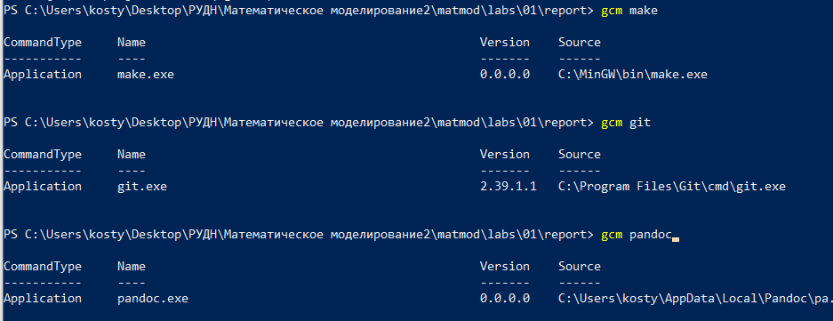
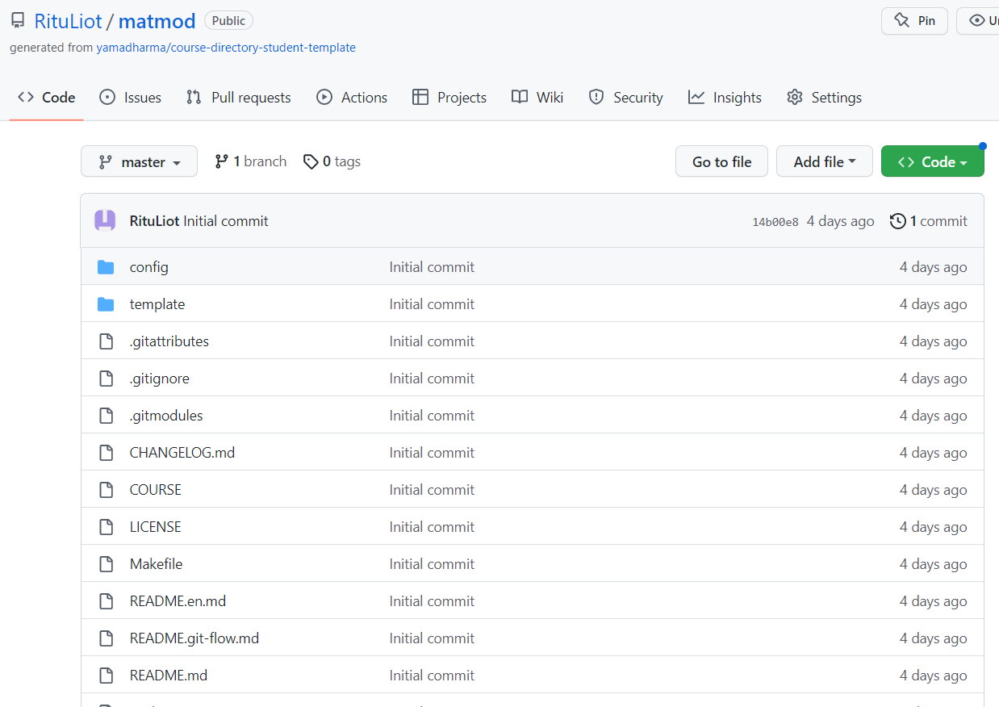
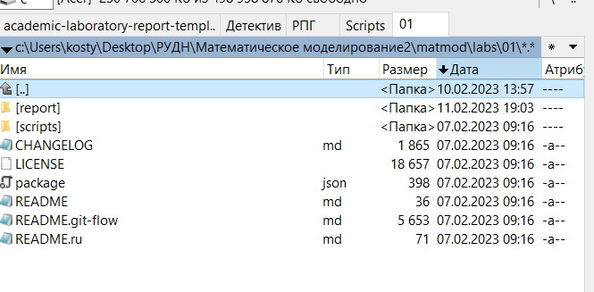
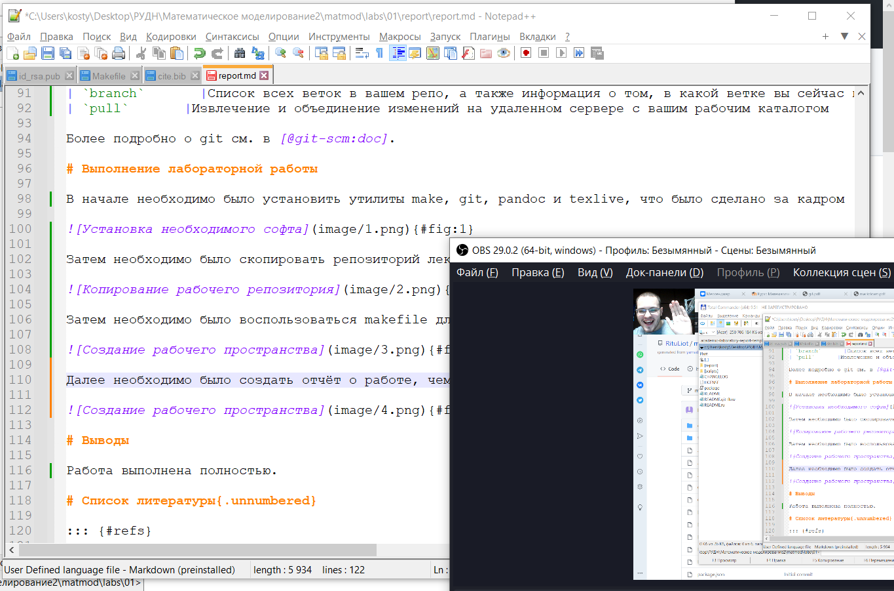
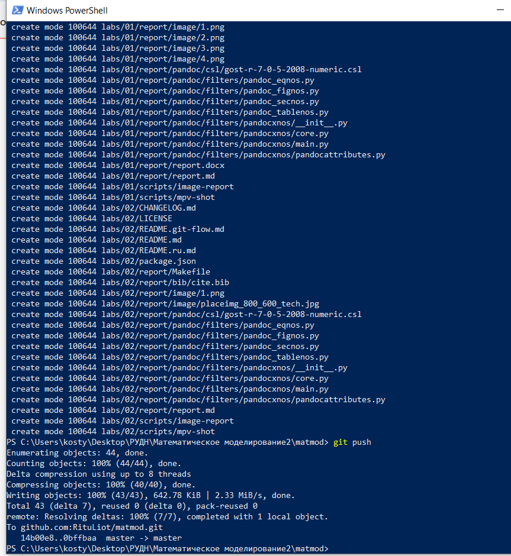

---
## Front matter
title: "Лабораторная работа №1"
subtitle: "Система контроля версий Git"
author: "Аникин Константин Сергеевич"

## Generic otions
lang: ru-RU
toc-title: "Содержание"

## Bibliography
bibliography: bib/cite.bib
csl: pandoc/csl/gost-r-7-0-5-2008-numeric.csl

## Pdf output format
toc: true # Table of contents
toc-depth: 2
lof: true # List of figures
lot: true # List of tables
fontsize: 12pt
linestretch: 1.5
papersize: a4
documentclass: scrreprt
## I18n polyglossia
polyglossia-lang:
  name: russian
  options:
	- spelling=modern
	- babelshorthands=true
polyglossia-otherlangs:
  name: english
## I18n babel
babel-lang: russian
babel-otherlangs: english
## Fonts
mainfont: PT Serif
romanfont: PT Serif
sansfont: PT Sans
monofont: PT Mono
mainfontoptions: Ligatures=TeX
romanfontoptions: Ligatures=TeX
sansfontoptions: Ligatures=TeX,Scale=MatchLowercase
monofontoptions: Scale=MatchLowercase,Scale=0.9
## Biblatex
biblatex: true
biblio-style: "gost-numeric"
biblatexoptions:
  - parentracker=true
  - backend=biber
  - hyperref=auto
  - language=auto
  - autolang=other*
  - citestyle=gost-numeric
## Pandoc-crossref LaTeX customization
figureTitle: "Рис."
tableTitle: "Таблица"
listingTitle: "Листинг"
lofTitle: "Список иллюстраций"
lotTitle: "Список таблиц"
lolTitle: "Листинги"
## Misc options
indent: true
header-includes:
  - \usepackage{indentfirst}
  - \usepackage{float} # keep figures where there are in the text
  - \floatplacement{figure}{H} # keep figures where there are in the text
---

# Цель работы

Вспомнить правила работы с GitHub и Markdown, установить необходимый софт, сделать отчёт об отчёте и загрузить его на гит.

# Задание

Сделайте отчёт по предыдущей лабораторной работе в формате Markdown в 3 форматах: pdf, docx и md (в архиве, поскольку он должен содержать скриншоты, Makefile и т.д.).

# Теоретическое введение

В табл. @tbl:1 приведено краткое описание базовых команд работы с git.

: Описание базовых команд git {#tbl:1}

| Имя каталога | Описание каталога                                                                                                          |
|--------------|----------------------------------------------------------------------------------------------------------------------------|
| `init`          |Создание нового локального репозитория                                                                               |
| `clone `      |Создание рабочей копии репозитория     |
| `add`       |Добавление одного или нескольких файлов в рабочую копию репозитория                                           |
| `commit`      |Коммит файлов, которые были добавилены с помощью git add, а также коммит любых файлов, которые вы изменили с тех пор  |
| `push`     |Отправка изменений в ветку master вашего удаленного репозитория                                                                                   |
| `status`      |Список файлов, которые вы изменили, и тех, которые вам еще нужно добавить или отправить                                                                                 |
| `branch`       |Список всех веток в вашем репо, а также информация о том, в какой ветке вы сейчас находитесь.                                                                                                             |
| `pull`       |Извлечение и объединение изменений на удаленном сервере с вашим рабочим каталогом                                                                                 |

Более подробно о git см. в [@git-scm:doc].

# Выполнение лабораторной работы

В начале необходимо было установить утилиты make, git, pandoc и texlive, что было сделано за кадром (рис. @fig:1).

{#fig:1}

Затем необходимо было скопировать репозиторий лектора на свой профиль в гите и на свой компьютер (рис. @fig:2).

{#fig:2} 

Затем необходимо было воспользоваться makefile для создания структуры папок, однако, в силу работы на виндоус, этого сделано не было, а поскольку семинарист разрешил создать это дело ручками, ручками и было сделано (рис. @fig:3).

{#fig:3}

Далее необходимо было создать отчёт о работе, чем я сейчас и занимаюсь (рис. @fig:4).

{#fig:4}

Под конец нужно залить отчёт на гит, что, после установки моего аккаунта как главного, я сделаю в ближайшем будущем (рис. @fig:5).

{#fig:5}

# Выводы

Работа выполнена полностью.

# Список литературы{.unnumbered}

::: {#refs}
:::
