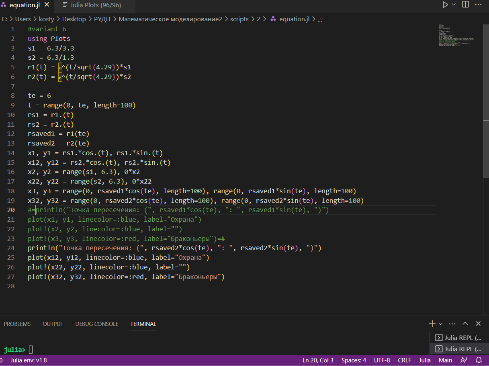
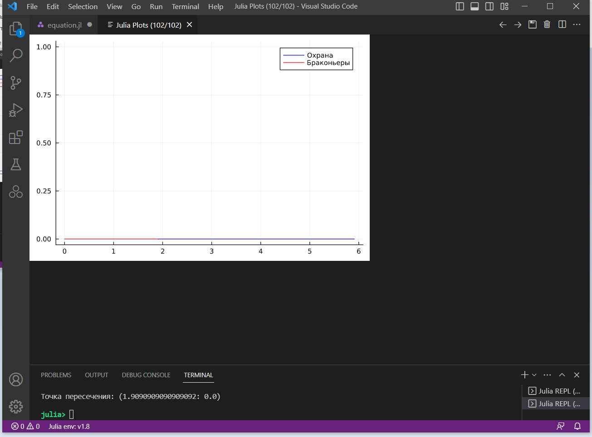
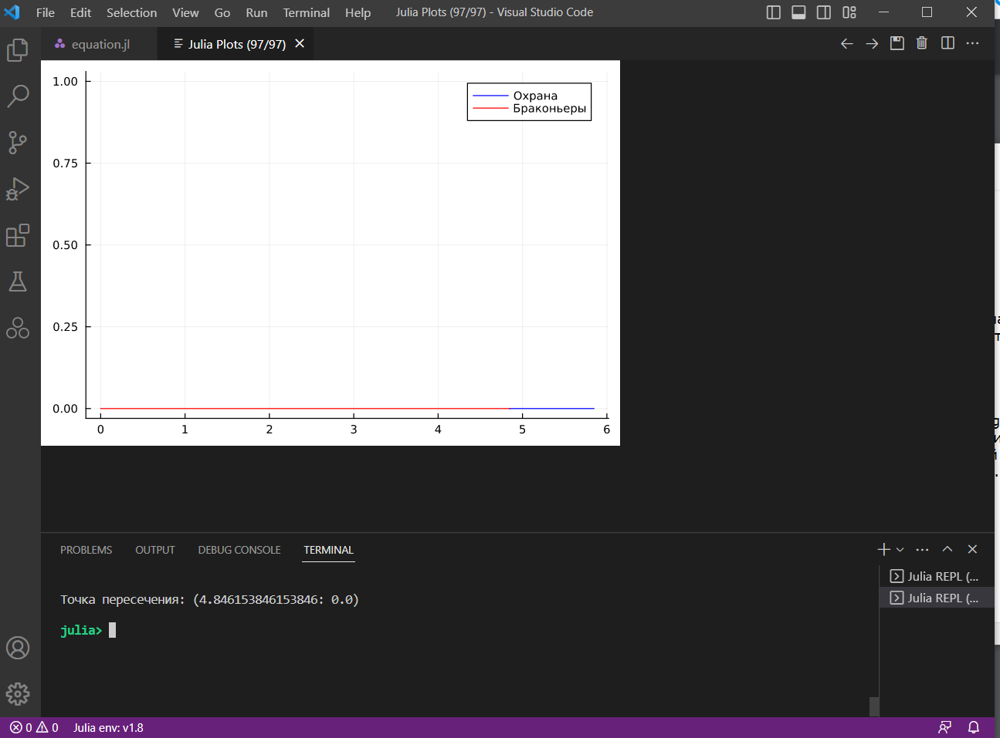
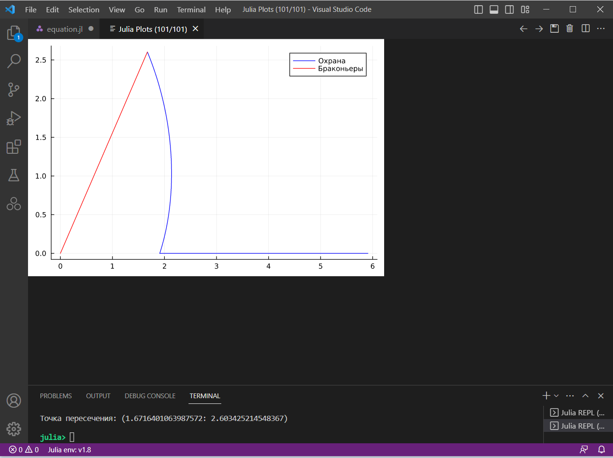
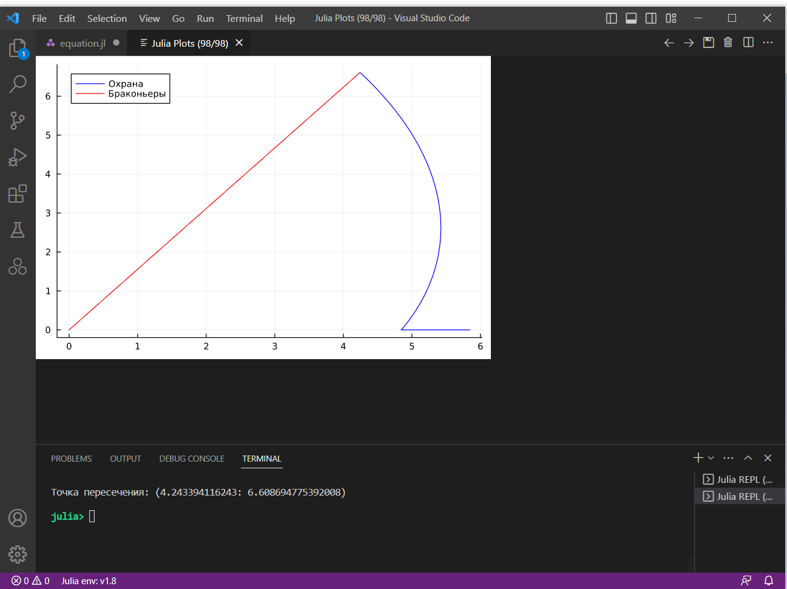
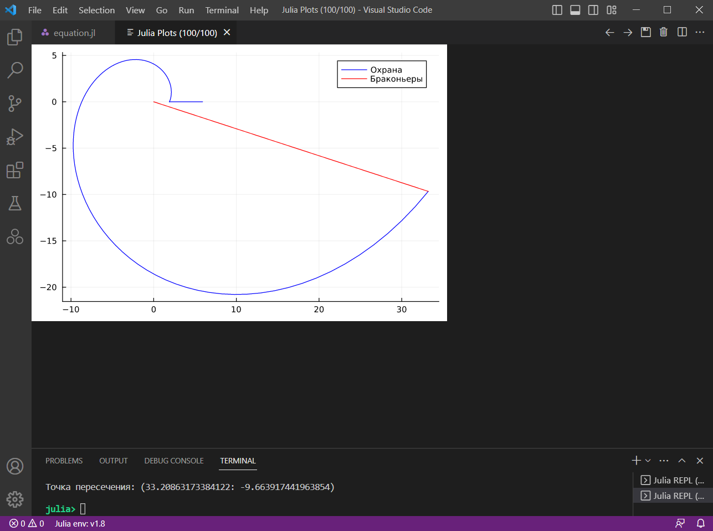
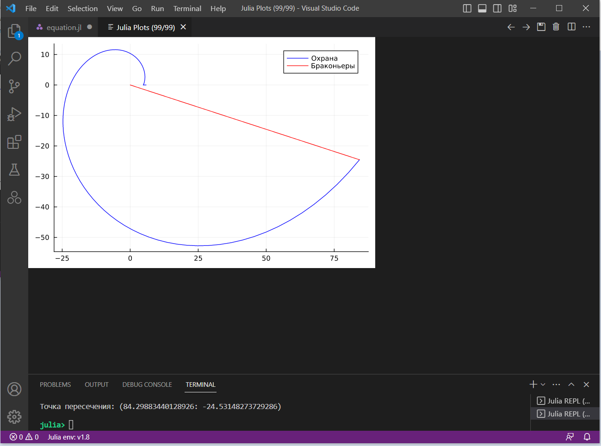

---
## Front matter
lang: ru-RU
title: Лабораторная работа №2
subtitle: Задача о погоне
author:
  - Аникин Константин Сергеевич
institute:
  - Российский университет дружбы народов, Москва, Россия
date: 18 февраля 2023

## i18n babel
babel-lang: russian
babel-otherlangs: english

## Formatting pdf
toc: false
toc-title: Содержание
slide_level: 2
aspectratio: 169
section-titles: true
theme: metropolis
header-includes:
 - \metroset{progressbar=frametitle,sectionpage=progressbar,numbering=fraction}
 - '\makeatletter'
 - '\beamer@ignorenonframefalse'
 - '\makeatother'
---

# Информация

## Докладчик

:::::::::::::: {.columns align=center}
::: 

  * Аникин Константин Сергеевич
  * студент
  * просто студент
  * Российский университет дружбы народов
  * [1032201736@rudn.ru](mailto:1032201736@rudn.ru)
  * <https://rituliot.github.io/ru/>

# Вводная часть

## Цель работы

- Решить задачу о погоне охраны (вариант 6) за браконьерами на Julia.

## Задание

- Запишите уравнение, описывающее движение катера
- Постройте траекторию движения катера и лодки для двух случаев.
- Найдите точку пересечения траектории катера и лодки.

# Выполнение работы

## Программа

Ход работы состоял в написании программы, решающей поставленное задание (рис. \ref{fig1}).

## Графики при 0 радиан

График для варианта с +1 (рис. \ref{fig2}) при 0 радиан

## Графики при 0 радиан

График для варианта с -1 (рис. \ref{fig3}) при 0 радиан

## Графики при 1 радиан

График для варианта с +1 (рис. \ref{fig4}) при 1 радиане

## Графики при 1 радиан

График для варианта с +1 (рис. \ref{fig5}) при 1 радиане

## Графики при 6 радианах

Графики для варианта с +1 (рис. \ref{fig6}) при 6 радианах

## Графики при 6 радианах

Графики для варианта с -1 (рис. \ref{fig7}) при 6 радианах

# Вывод

В ходе работы я познакомился с Julia, решил задачу о погоне и решил её с помощью Джулии. Мог ошибиться в математике. Код выглядит отвратительно, хочется взять и... и отрефакторить. Хотя бы работает, и на том спасибо.

