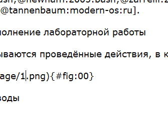
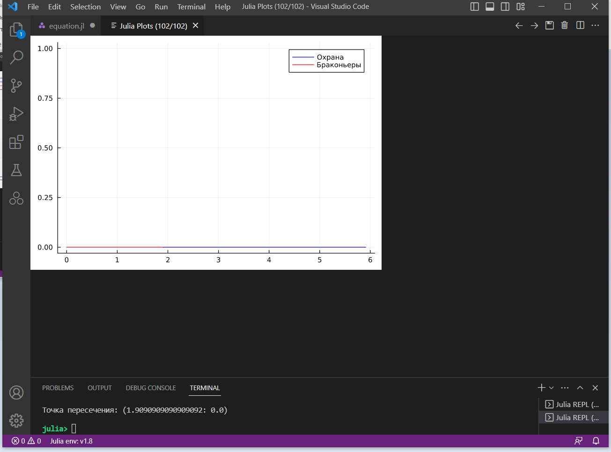
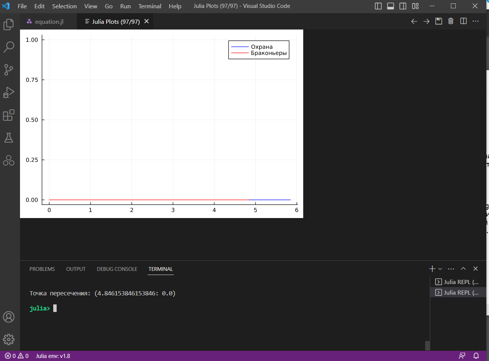
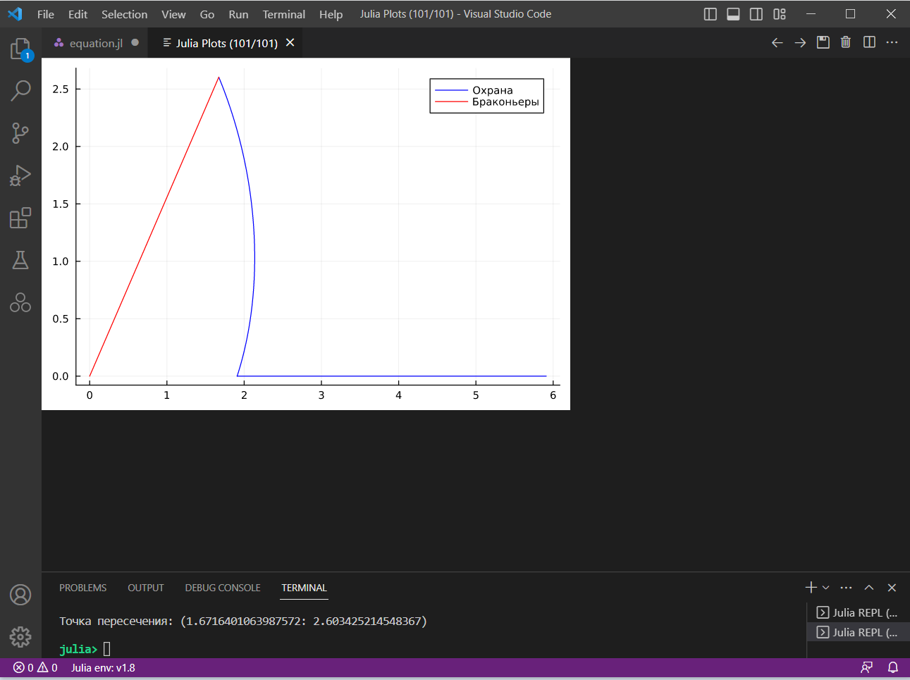
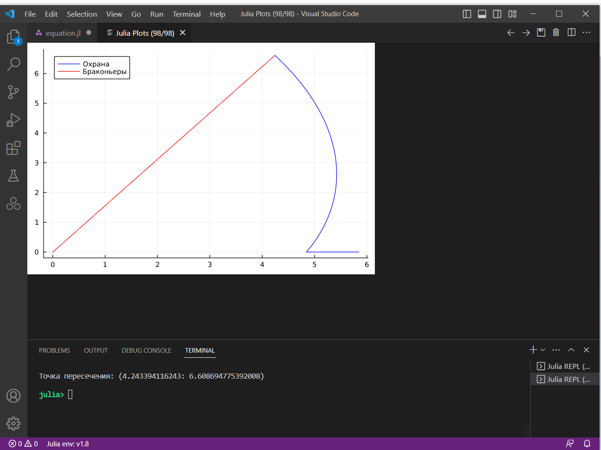
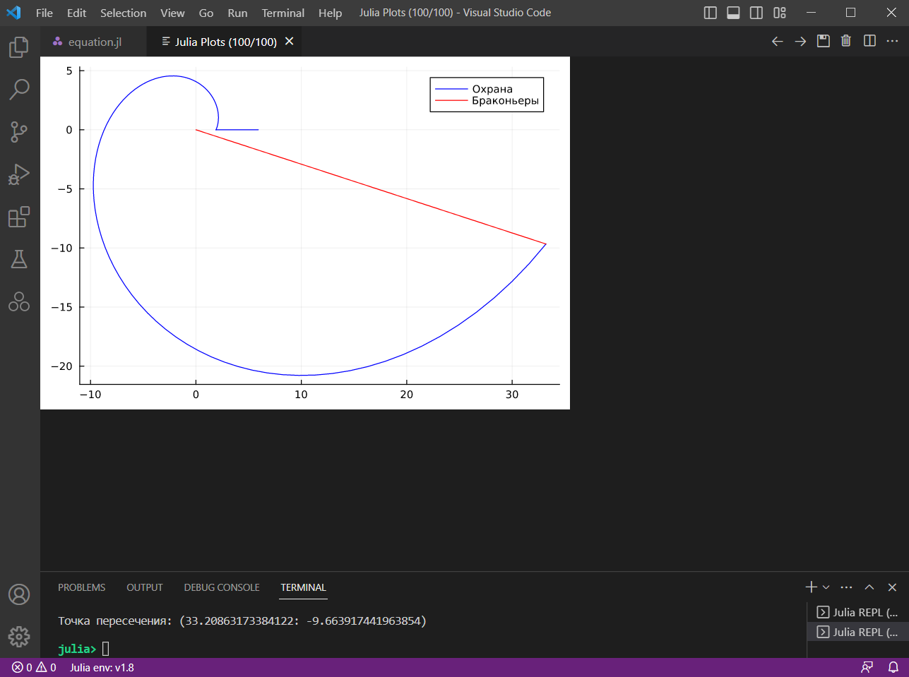
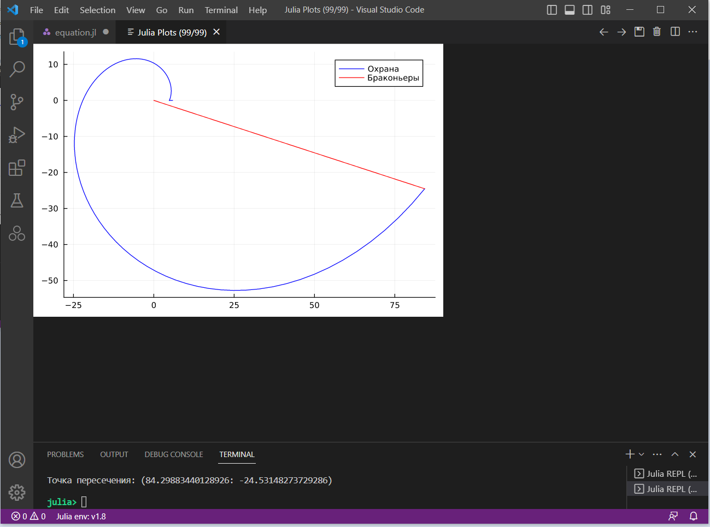

---
## Front matter
title: "Лабораторная работа №2"
subtitle: "Задача о погоне"
author: "Аникин Константин Сергеевич"

## Generic otions
lang: ru-RU
toc-title: "Содержание"

## Bibliography
bibliography: bib/cite.bib
csl: pandoc/csl/gost-r-7-0-5-2008-numeric.csl

## Pdf output format
toc: true # Table of contents
toc-depth: 2
lof: true # List of figures
lot: true # List of tables
fontsize: 12pt
linestretch: 1.5
papersize: a4
documentclass: scrreprt
## I18n polyglossia
polyglossia-lang:
  name: russian
  options:
	- spelling=modern
	- babelshorthands=true
polyglossia-otherlangs:
  name: english
## I18n babel
babel-lang: russian
babel-otherlangs: english
## Fonts
mainfont: PT Serif
romanfont: PT Serif
sansfont: PT Sans
monofont: PT Mono
mainfontoptions: Ligatures=TeX
romanfontoptions: Ligatures=TeX
sansfontoptions: Ligatures=TeX,Scale=MatchLowercase
monofontoptions: Scale=MatchLowercase,Scale=0.9
## Biblatex
biblatex: true
biblio-style: "gost-numeric"
biblatexoptions:
  - parentracker=true
  - backend=biber
  - hyperref=auto
  - language=auto
  - autolang=other*
  - citestyle=gost-numeric
## Pandoc-crossref LaTeX customization
figureTitle: "Рис."
tableTitle: "Таблица"
listingTitle: "Листинг"
lofTitle: "Список иллюстраций"
lotTitle: "Список таблиц"
lolTitle: "Листинги"
## Misc options
indent: true
header-includes:
  - \usepackage{indentfirst}
  - \usepackage{float} # keep figures where there are in the text
  - \floatplacement{figure}{H} # keep figures where there are in the text
---

# Цель работы

Решить задачу о погоне охраны за браконьерами на Julia.

# Задание

На море в тумане катер береговой охраны преследует лодку браконьеров. Через определенный промежуток времени туман рассеивается, и лодка обнаруживается на расстоянии 6,3 км от катера. Затем лодка снова скрывается в тумане и уходит прямолинейно в неизвестном направлении. Известно, что скорость катера в 2,3 раза больше скорости браконьерской лодки.

1. Запишите уравнение, описывающее движение катера, с начальными условиями для двух случаев (в зависимости от расположения катера относительно лодки в начальный момент времени).

2. Постройте траекторию движения катера и лодки для двух случаев.

3. Найдите точку пересечения траектории катера и лодки.

# Теоретическое введение

Julia — высокоуровневый высокопроизводительный свободный язык программирования с динамической типизацией, созданный для математических вычислений. Эффективен также и для написания программ общего назначения. Имеет встроенную поддержку многопоточности и распределённых вычислений, реализованные в том числе в стандартных конструкциях.

Язык является динамическим, при этом поддерживает JIT-компиляцию (JIT-компилятор на основе LLVM входит в стандартный комплект), благодаря чему, по утверждению авторов языка, приложения, полностью написанные на языке (без использование низкоуровневых библиотек и векторных операций) практически не уступают в производительности приложениям, написанным на статически компилируемых языках, таких как Си или C++. Большая часть стандартной библиотеки языка написана на нём же.

Поддерживается перегрузка функций и операторов (которые фактически также являются функциями), при этом опционально можно указывать тип для аргументов функции, чего обычно нет в динамически типизируемых языках. Это позволяет создавать специализированные варианты функций и операторов для ускорения вычислений. Наиболее подходящий вариант функции выбирается автоматически в процессе выполнения. Также благодаря перегрузке операторов можно создавать новые типы данных, которые ведут себя подобно встроенным типам.

Более подробно о работе с Julia см. в [@julialang:julia;@sje30:catam-julia].

# Выполнение лабораторной работы

В ходе выполнения работы я написал программу, высчитывающую траекторию кораблей и строящую графики их движения до точки пересечения (рис. @fig:1). 

Программа высчитывает траекторию движения корабля, находит длину отрезка от начала координат до точки пересечения, строит прямую движения браконьеров, а после рисует это на графике и выводит точку пересечения в терминал. Вычисления проводятся для обоих вариантов, перекомментировав нужное можно увидеть вывод второго варианта.

{#fig:1}

Далее представлены графики, посчитанные для разных входных данных. На рис. @fig:2 и @fig:3 представлены графики при угле в 0 радиан, на рис. @fig:4 и @fig:5 представлены графики при угле в 1 радиан, и на рис. @fig:6 и @fig:7 представлены графики при угле в 6 радиан. Первый и второй графики каждой пары рассчитаны на первый и второй вариант задачи соответственно.

Точка пересечения считается в декартовых координатах

{#fig:2}

{#fig:3}

{#fig:4}

{#fig:5}

{#fig:6}

{#fig:7}

# Выводы

В ходе работы я познакомился с Julia, решил задачу о погоне и решил её с помощью Джулии. Мог ошибиться в математике. Код выглядит отвратительно, хочется взять и... и отрефакторить. Хотя бы работает, и на том спасибо.

# Список литературы{.unnumbered}

::: {#refs}
:::
