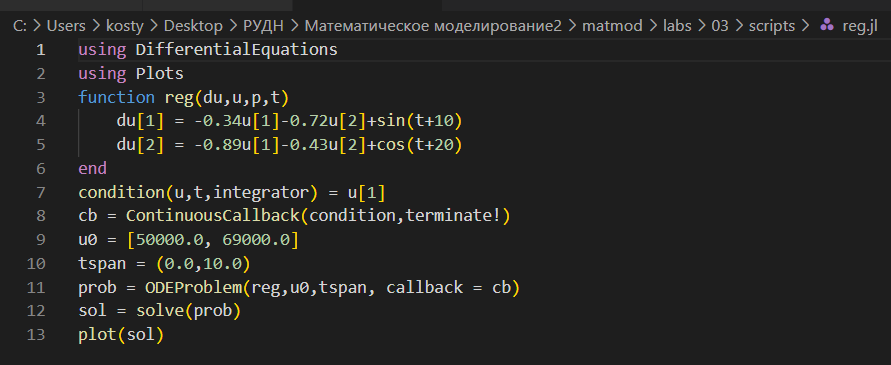
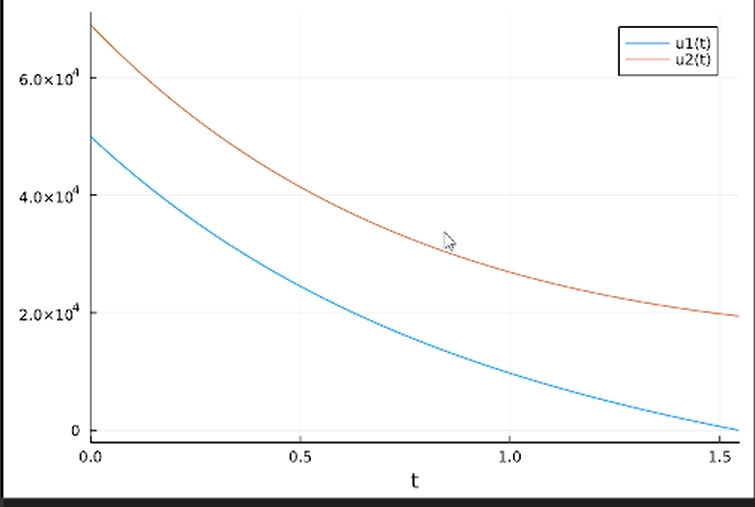
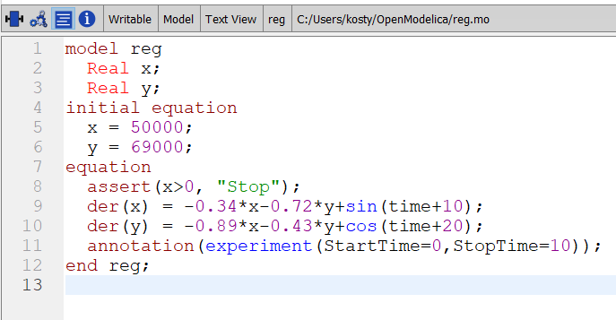
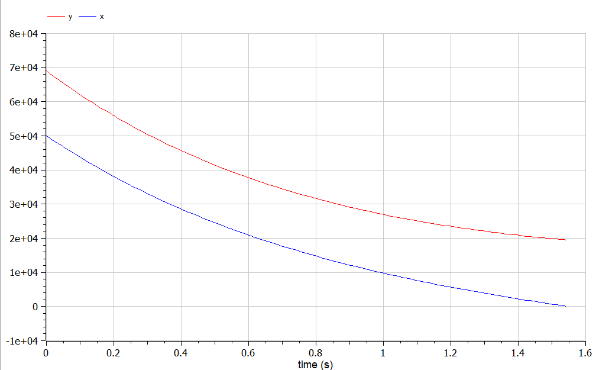
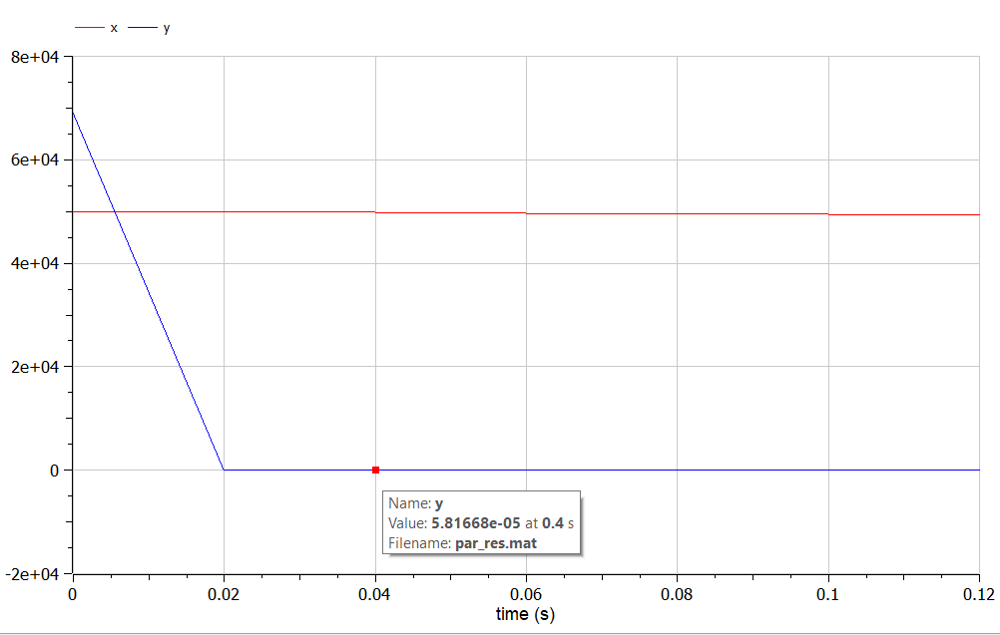

---
## Front matter
lang: ru-RU
title: Лабораторная работа №3
subtitle: Модель боевых действий
author:
  - Аникин Константин Сергеевич
institute:
  - Российский университет дружбы народов, Москва, Россия
date: 25 февраля 2023

## i18n babel
babel-lang: russian
babel-otherlangs: english

## Formatting pdf
toc: false
toc-title: Содержание
slide_level: 2
aspectratio: 169
section-titles: true
theme: metropolis
header-includes:
 - \metroset{progressbar=frametitle,sectionpage=progressbar,numbering=fraction}
 - '\makeatletter'
 - '\beamer@ignorenonframefalse'
 - '\makeatother'
---

# Информация

## Докладчик

:::::::::::::: {.columns align=center}
::: 

  * Аникин Константин Сергеевич
  * студент
  * просто студент
  * Российский университет дружбы народов
  * [1032201736@rudn.ru](mailto:1032201736@rudn.ru)
  * <https://rituliot.github.io/ru/>

# Вводная часть

## Цель работы

Смоделировать численность войск в военное время на Julia и OpenModelica.

## Задание

Постройте графики изменения численности войск армии Х и армии У для
следующих случаев (вариант 6):

1. Модель боевых действий между регулярными войсками

2. Модель ведение боевых действий с участием регулярных войск и партизанских отрядов

# Выполнение работы на Julia

## Скрипт

Скрипт обычного случая (рис. \ref{fig1}).

## График обычного случая

График обычного случая (рис. \ref{fig3}).

## График партизанского случая

График партизанского случая (рис. \ref{fig4}).

# Выполнение работы на OpenModelica

## Скрипт

Скрипт обычного случая (рис. \ref{fig6}).

## График обычного случая

График обычного случая (рис. \ref{fig8}).

## График партизанского случая

График партизанского случая (рис. \ref{fig9}).

# Вывод

В ходе работы были реализованы два случая модели боевых действий на двух программных обеспечениях. Математическая составляющая не должна была пострадать, код тоже выглядит приемлемо.

