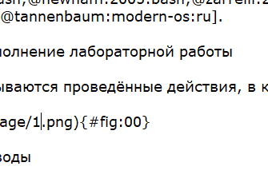
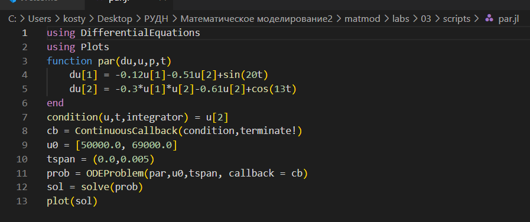
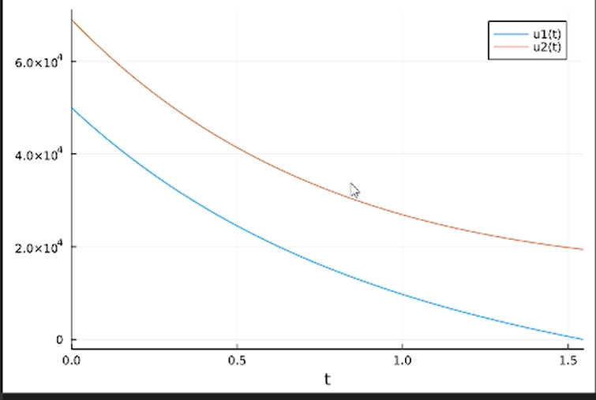
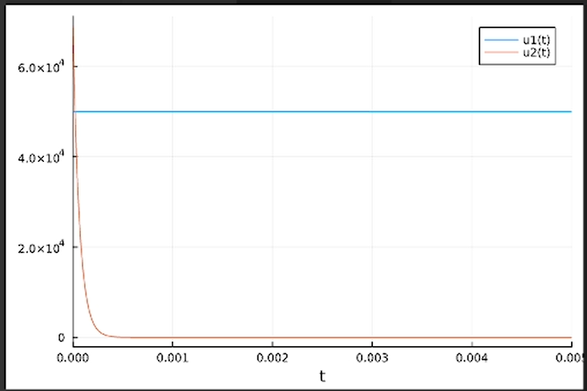
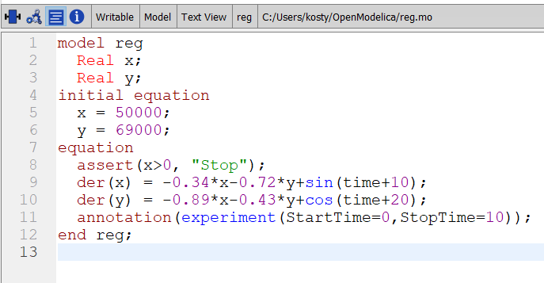
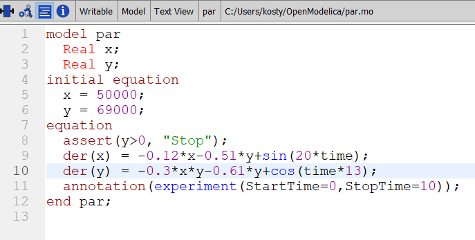
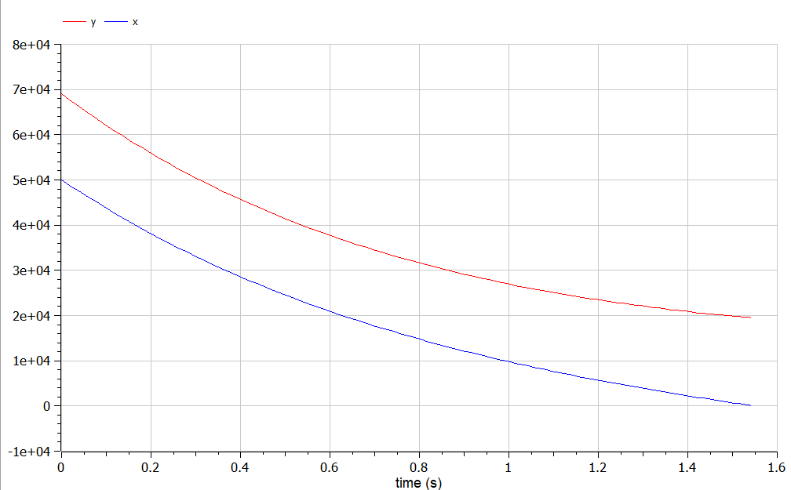
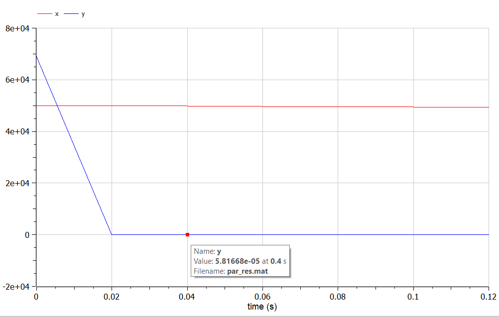

---
## Front matter
title: "Лабораторная работа №3"
subtitle: "Модель боевых действий"
author: "Аникин Константин Сергеевич"

## Generic otions
lang: ru-RU
toc-title: "Содержание"

## Bibliography
bibliography: bib/cite.bib
csl: pandoc/csl/gost-r-7-0-5-2008-numeric.csl

## Pdf output format
toc: true # Table of contents
toc-depth: 2
lof: true # List of figures
lot: true # List of tables
fontsize: 12pt
linestretch: 1.5
papersize: a4
documentclass: scrreprt
## I18n polyglossia
polyglossia-lang:
  name: russian
  options:
	- spelling=modern
	- babelshorthands=true
polyglossia-otherlangs:
  name: english
## I18n babel
babel-lang: russian
babel-otherlangs: english
## Fonts
mainfont: PT Serif
romanfont: PT Serif
sansfont: PT Sans
monofont: PT Mono
mainfontoptions: Ligatures=TeX
romanfontoptions: Ligatures=TeX
sansfontoptions: Ligatures=TeX,Scale=MatchLowercase
monofontoptions: Scale=MatchLowercase,Scale=0.9
## Biblatex
biblatex: true
biblio-style: "gost-numeric"
biblatexoptions:
  - parentracker=true
  - backend=biber
  - hyperref=auto
  - language=auto
  - autolang=other*
  - citestyle=gost-numeric
## Pandoc-crossref LaTeX customization
figureTitle: "Рис."
tableTitle: "Таблица"
listingTitle: "Листинг"
lofTitle: "Список иллюстраций"
lotTitle: "Список таблиц"
lolTitle: "Листинги"
## Misc options
indent: true
header-includes:
  - \usepackage{indentfirst}
  - \usepackage{float} # keep figures where there are in the text
  - \floatplacement{figure}{H} # keep figures where there are in the text
---

# Цель работы

Смоделировать численность войск в военное время на Julia и OpenModelica.

# Задание

Постройте графики изменения численности войск армии Х и армии У для
следующих случаев (вариант 6):

1. Модель боевых действий между регулярными войсками

2. Модель ведение боевых действий с участием регулярных войск и партизанских отрядов

# Теоретическое введение

Рассмотрим некоторые простейшие модели боевых действий – модели Ланчестера. В противоборстве могут принимать участие как регулярные войска, так и партизанские отряды. В общем случае главной характеристикой соперников являются численности сторон. Если в какой-то момент времени одна из численностей обращается в нуль, то данная сторона считается проигравшей (при условии, что численность другой стороны в данный момент положительна).

В простейшей модели борьбы двух противников коэффициенты bt() и ct() являются постоянными. Попросту говоря, предполагается, что каждый солдат армии x убивает за единицу времени c солдат армии y (и, соответственно, каждый солдат армии y убивает b солдат армии x). Также не учитываются потери, не связанные с боевыми действиями, и возможность подхода подкрепления. Состояние системы описывается точкой (x,y) положительного квадранта плоскости. Координаты этой точки, x и y - это численности противостоящих армий.

Вывод модели таков: для борьбы с вдвое более многочисленным противником нужно в четыре раза более мощное оружие, с втрое более многочисленным - в девять раз и т. д. (на это указывают квадратные корни в уравнении прямой). Стоит помнить, что эта модель сильно идеализирована и неприменима к реальной ситуации. Но может использоваться для начального анализа. 

Подробнее о модели Ланчестера см. в [@osipov:1915:num]

# Выполнение лабораторной работы

Код программы на Julia представлен на рис. @fig:1 и рис. @fig:2 для обычного и партизанских случаев соответственно, а также в папке scripts. В программе реализована система уравнений, решаемых ODEProblem. Callback используется для остановки счёта при уничтожении одной из армий.

{#fig:1}

{#fig:2}

На рис. @fig:3 и рис. @fig:4 представлены графики обычного и партизанского случаев. 

{#fig:3}

{#fig:4}

Код программы на OpenModelica представлен на рис. @fig:6 и рис. @fig:7 для обычного и партизанских случаев соответственно, а также в папке scripts. Для ранней остановки используется assert.

{#fig:6}

{#fig:7}

На рис. @fig:8 и рис. @fig:9 представлены графики обычного и партизанского случаев. 

{#fig:8}

{#fig:9}

# Выводы

В ходе работы были реализованы два случая модели боевых действий на двух программных обеспечениях. Математическая составляющая не должна была пострадать, код тоже выглядит приемлемо.

# Список литературы{.unnumbered}

::: {#refs}
:::
