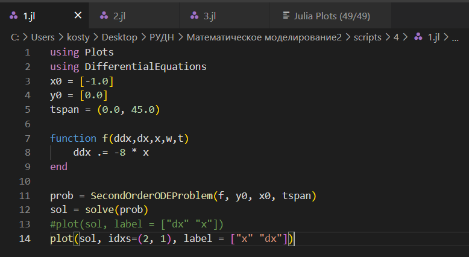
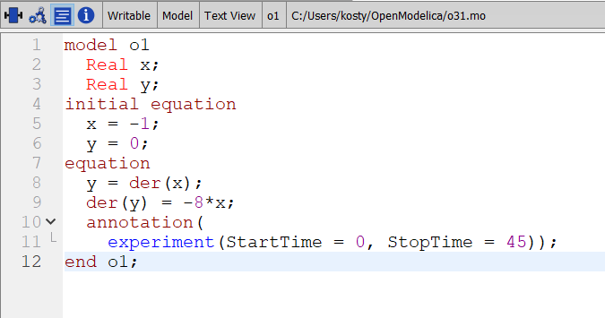
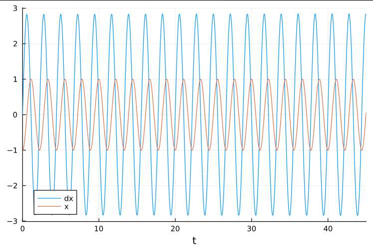
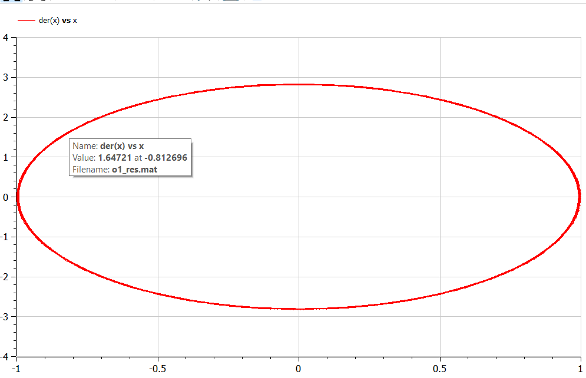
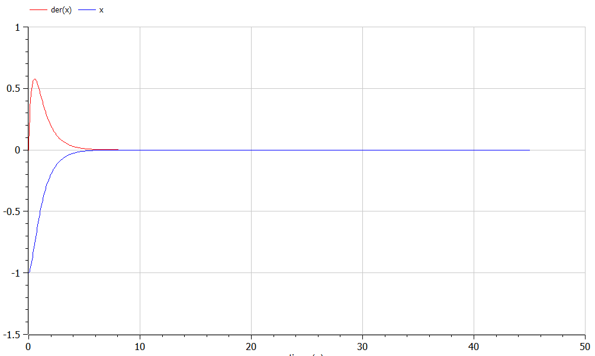
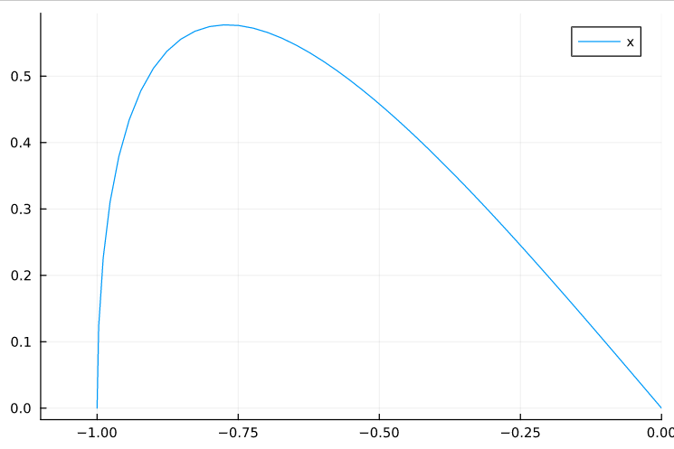
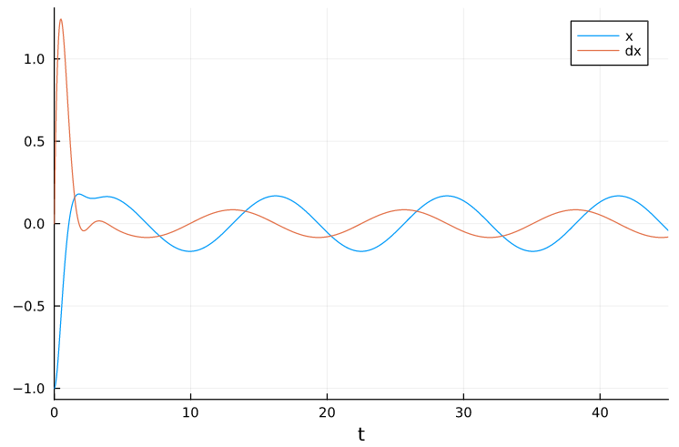
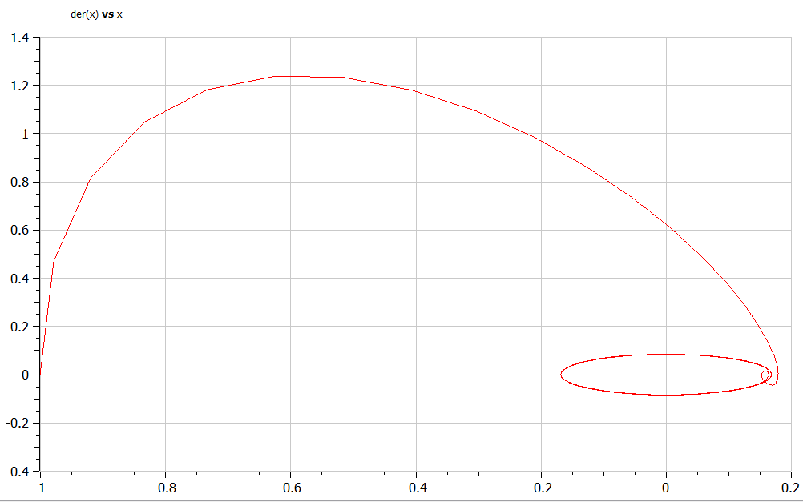

---
## Front matter
lang: ru-RU
title: Лабораторная работа №4
subtitle: Модель гармонических колебаний
author:
  - Аникин Константин Сергеевич
institute:
  - Российский университет дружбы народов, Москва, Россия
date: 01 марта 2023

## i18n babel
babel-lang: russian
babel-otherlangs: english

## Formatting pdf
toc: false
toc-title: Содержание
slide_level: 2
aspectratio: 169
section-titles: true
theme: metropolis
header-includes:
 - \metroset{progressbar=frametitle,sectionpage=progressbar,numbering=fraction}
 - '\makeatletter'
 - '\beamer@ignorenonframefalse'
 - '\makeatother'
---

# Информация

## Докладчик

:::::::::::::: {.columns align=center}
::: 

  * Аникин Константин Сергеевич
  * студент
  * просто студент
  * Российский университет дружбы народов
  * [1032201736@rudn.ru](mailto:1032201736@rudn.ru)
  * <https://rituliot.github.io/ru/>

# Вводная часть

## Цель работы

Построить модель гармонических колебаний в трёх случаях в Julia и OpenModelica.

## Задание

Постройте фазовый портрет гармонического осциллятора и решение уравнения
гармонического осциллятора для следующих случаев:

1. Колебания гармонического осциллятора без затуханий и без действий внешней
силы

2. Колебания гармонического осциллятора c затуханием и без действий внешней
силы

3. Колебания гармонического осциллятора c затуханием и под действием внешней
силы

# Выполнение работы

## Код на Julia

Код решения программы на Julia на рис. \ref{fig1}.

## Код на OpenModelica

Код решения программы на OpenModelica на рис. \ref{fig10}.

## График первого случая

График решения первого случая на рис. \ref{fig2}.

## График первого случая

Фазовый портрет первого случая на рис. \ref{fig12}.

## График второго случая

График решения второго случая на рис. \ref{fig14}.

## График второго случая

Фазовый портрет второго случая на рис. \ref{fig6}.

## График третьего случая

График решения третьего случая на рис. \ref{fig8}.

## График третьего случая

Фазовый портрет третьего случая на рис. \ref{fig18}.

# Вывод

Работа выполнена полностью и без ошибок. Код можно прокачать, но жить можно.