---
## Front matter
title: "Лабораторная работа №4"
subtitle: "Модель гармонических колебаний"
author: "Аникин Константин Сергеевич"

## Generic otions
lang: ru-RU
toc-title: "Содержание"

## Bibliography
bibliography: bib/cite.bib
csl: pandoc/csl/gost-r-7-0-5-2008-numeric.csl

## Pdf output format
toc: true # Table of contents
toc-depth: 2
lof: true # List of figures
lot: true # List of tables
fontsize: 12pt
linestretch: 1.5
papersize: a4
documentclass: scrreprt
## I18n polyglossia
polyglossia-lang:
  name: russian
  options:
	- spelling=modern
	- babelshorthands=true
polyglossia-otherlangs:
  name: english
## I18n babel
babel-lang: russian
babel-otherlangs: english
## Fonts
mainfont: PT Serif
romanfont: PT Serif
sansfont: PT Sans
monofont: PT Mono
mainfontoptions: Ligatures=TeX
romanfontoptions: Ligatures=TeX
sansfontoptions: Ligatures=TeX,Scale=MatchLowercase
monofontoptions: Scale=MatchLowercase,Scale=0.9
## Biblatex
biblatex: true
biblio-style: "gost-numeric"
biblatexoptions:
  - parentracker=true
  - backend=biber
  - hyperref=auto
  - language=auto
  - autolang=other*
  - citestyle=gost-numeric
## Pandoc-crossref LaTeX customization
figureTitle: "Рис."
tableTitle: "Таблица"
listingTitle: "Листинг"
lofTitle: "Список иллюстраций"
lotTitle: "Список таблиц"
lolTitle: "Листинги"
## Misc options
indent: true
header-includes:
  - \usepackage{indentfirst}
  - \usepackage{float} # keep figures where there are in the text
  - \floatplacement{figure}{H} # keep figures where there are in the text
---

# Цель работы

Построить модель гармонических колебаний в трёх случаях в Julia и OpenModelica.

# Задание

Вариант 6

Постройте фазовый портрет гармонического осциллятора и решение уравнения
гармонического осциллятора для следующих случаев:

1. Колебания гармонического осциллятора без затуханий и без действий внешней
силы

2. Колебания гармонического осциллятора c затуханием и без действий внешней
силы

3. Колебания гармонического осциллятора c затуханием и под действием внешней
силы

# Теоретическое введение

Движение грузика на пружинке, маятника, заряда в электрическом контуре, а
также эволюция во времени многих систем в физике, химии, биологии и других
науках при определенных предположениях можно описать одним и тем же
дифференциальным уравнением, которое в теории колебаний выступает в качестве
основной модели. Эта модель называется линейным гармоническим осциллятором.

Независимые переменные x, y определяют пространство, в котором
«движется» решение. Это фазовое пространство системы, поскольку оно двумерно
будем называть его фазовой плоскостью.

Значение фазовых координат x, y в любой момент времени полностью
определяет состояние системы. Решению уравнения движения как функции
времени отвечает гладкая кривая в фазовой плоскости. Она называется фазовой
траекторией. Если множество различных решений (соответствующих различным
начальным условиям) изобразить на одной фазовой плоскости, возникает общая
картина поведения системы. Такую картину, образованную набором фазовых
траекторий, называют фазовым портретом.

Более подробно о модели гармонического осциллятора см. в [@martinson:2002:physics].

# Выполнение лабораторной работы

На рис. @fig:1 представлен код, реализованный на Julia, для первого случая. На рис. @fig:2 и рис. @fig:3 представлены график решения и фазовый портрет.

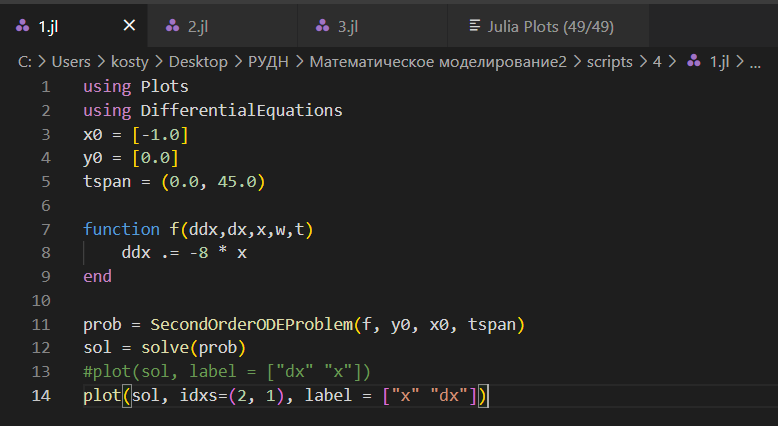{#fig:1}

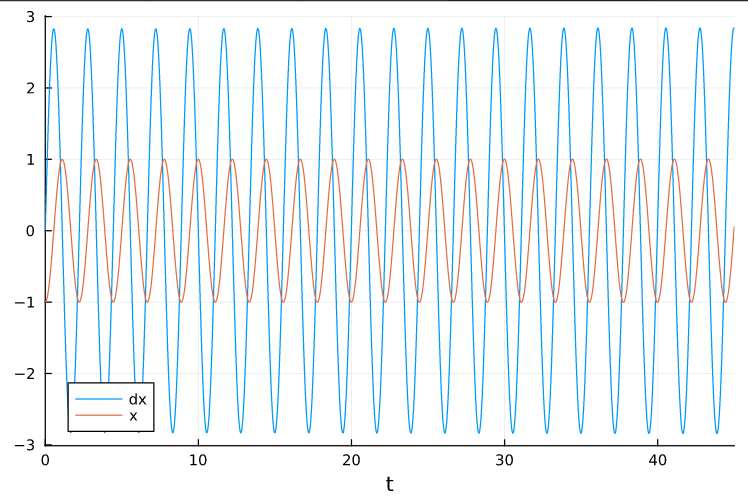{#fig:2}

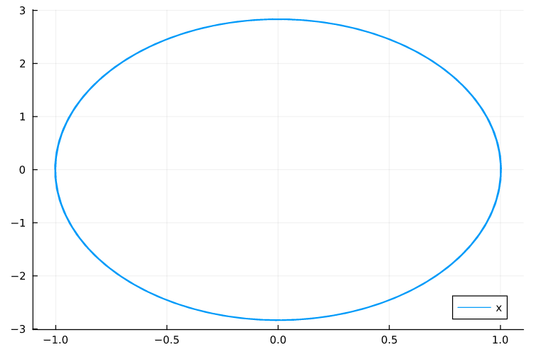{#fig:3}

На рис. @fig:4 представлен код, реализованный на Julia, для второго случая. На рис. @fig:5 и рис. @fig:6 представлены график решения и фазовый портрет.

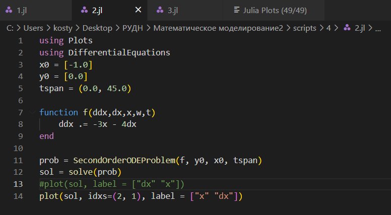{#fig:4}

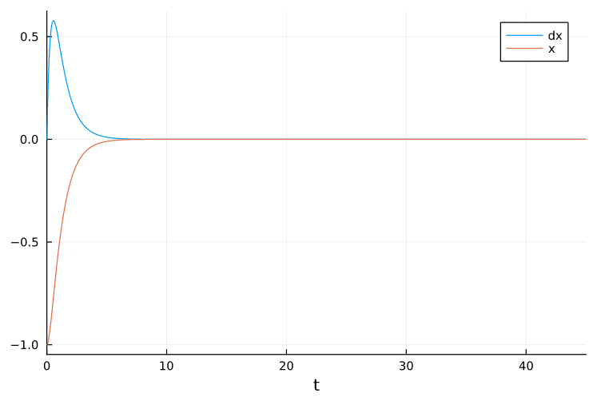{#fig:5}

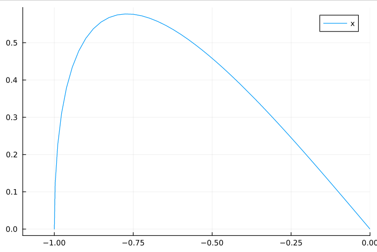{#fig:6}

На рис. @fig:7 представлен код, реализованный на Julia, для третьего случая. На рис. @fig:8 и рис. @fig:9 представлены график решения и фазовый портрет.

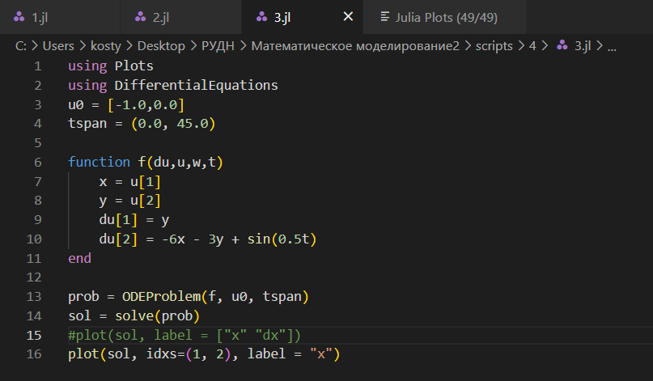{#fig:7}

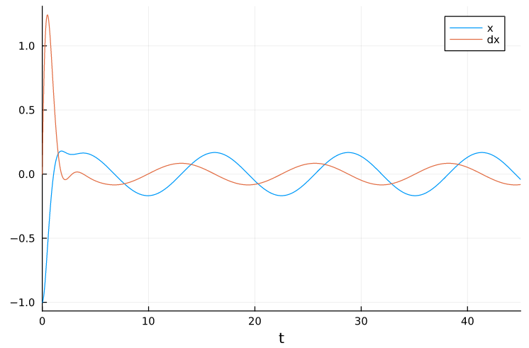{#fig:8}

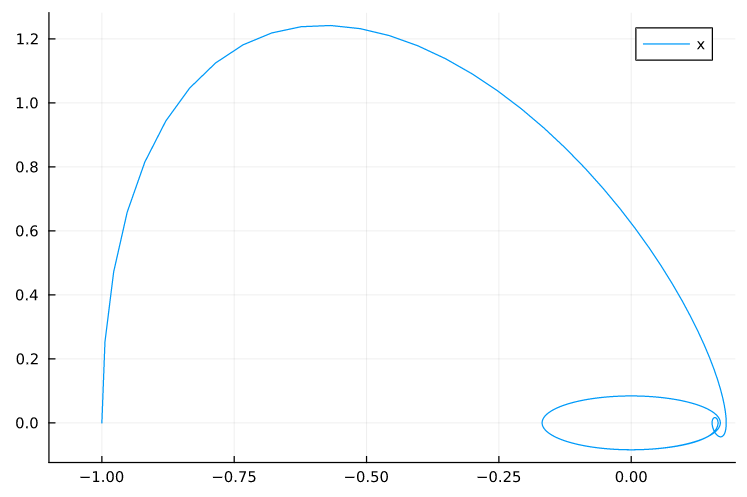{#fig:9}

На рис. @fig:10 представлен код, реализованный на OpenModelica, для первого случая. На рис. @fig:11 и рис. @fig:12 представлены график решения и фазовый портрет.

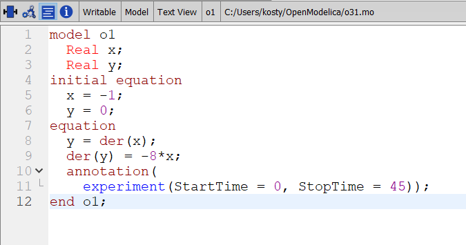{#fig:10}

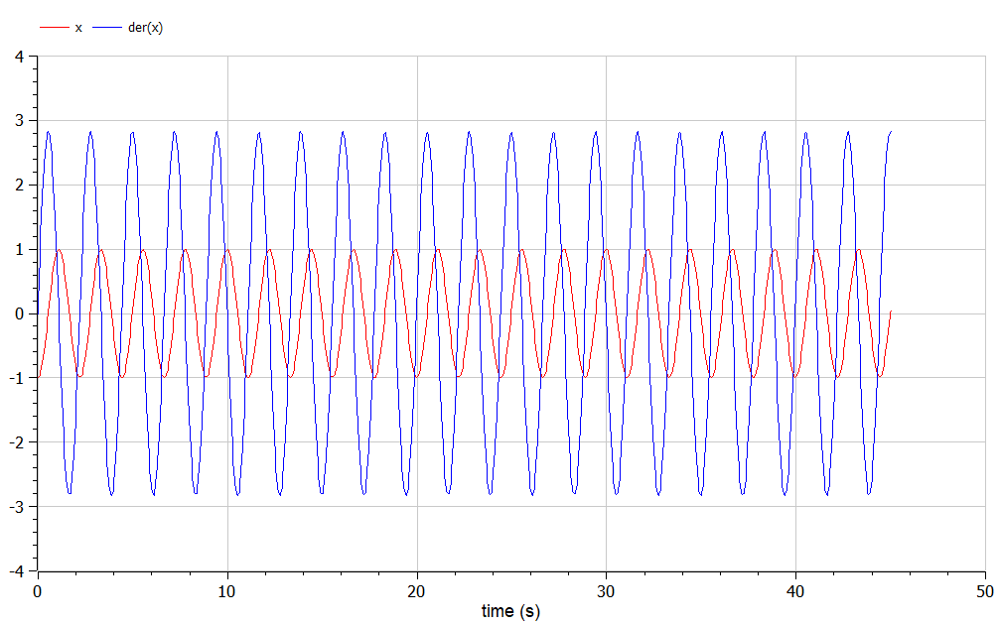{#fig:11}

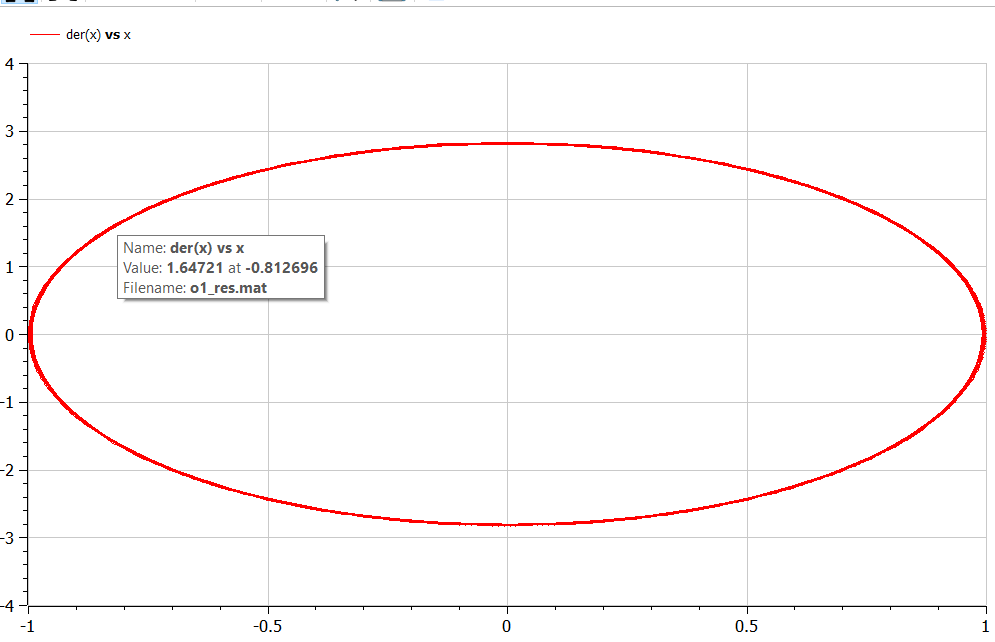{#fig:12}

На рис. @fig:13 представлен код, реализованный на OpenModelica, для второго случая. На рис. @fig:14 и рис. @fig:15 представлены график решения и фазовый портрет.

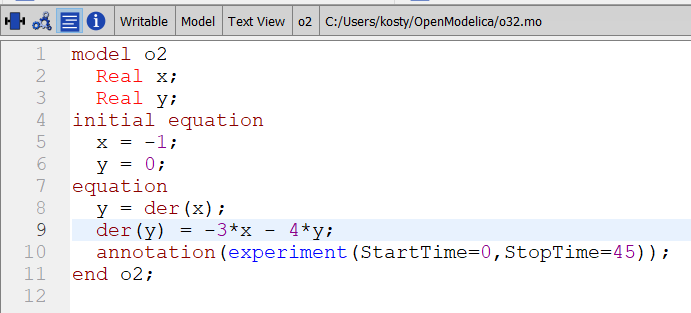{#fig:13}

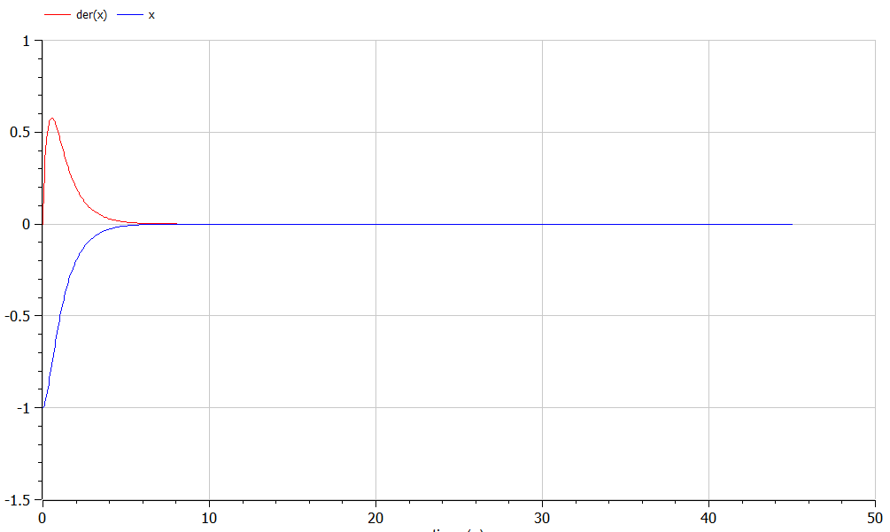{#fig:14}

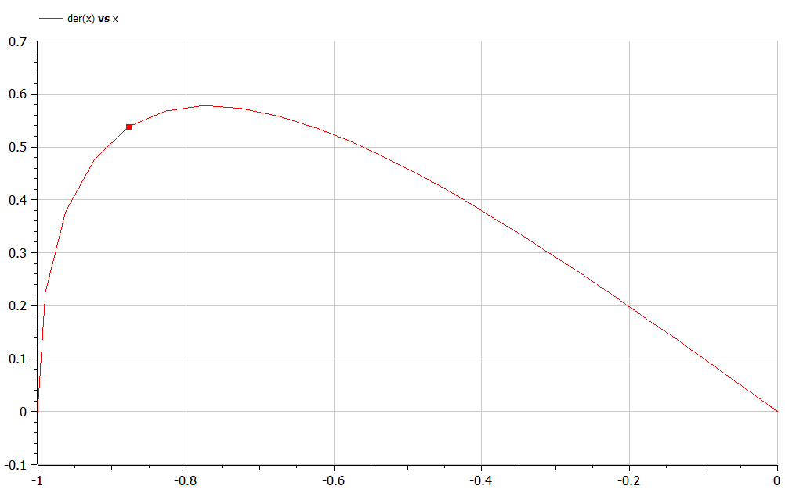{#fig:15}

На рис. @fig:16 представлен код, реализованный на Julia, для третьего случая. На рис. @fig:17 и рис. @fig:18 представлены график решения и фазовый портрет.

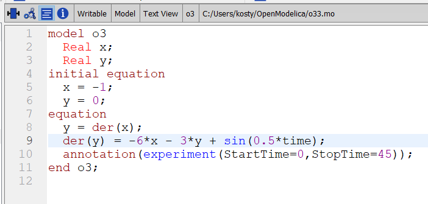{#fig:16}

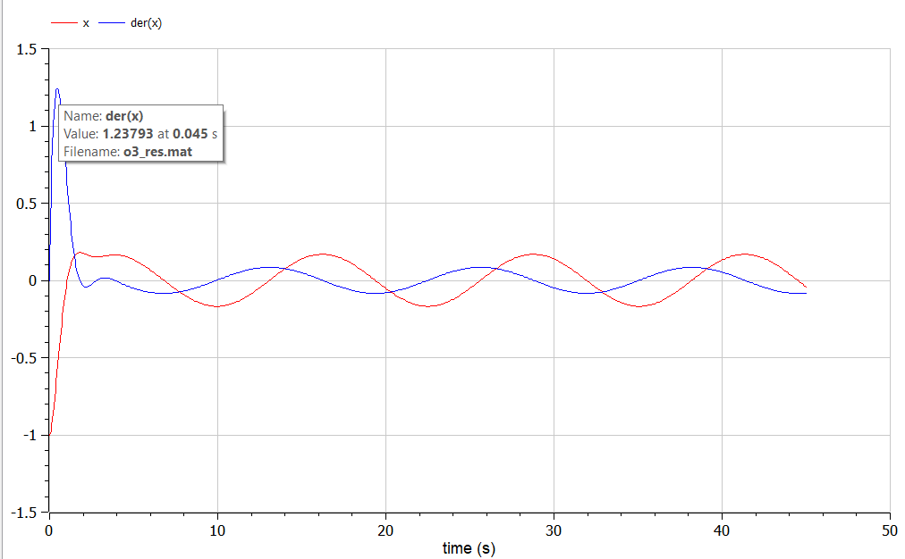{#fig:17}

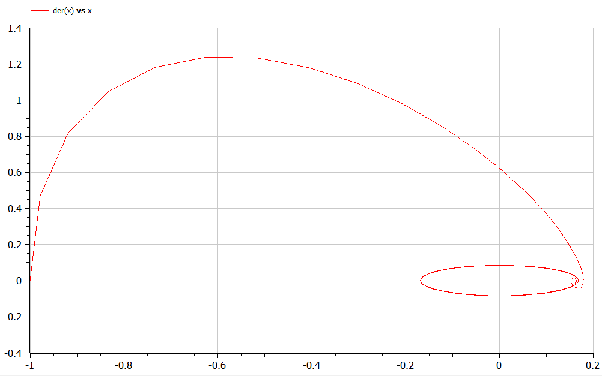{#fig:18}

# Выводы

Работа выполнена полностью и без ошибок. Код можно прокачать, но жить можно.

# Список литературы{.unnumbered}

::: {#refs}
:::
