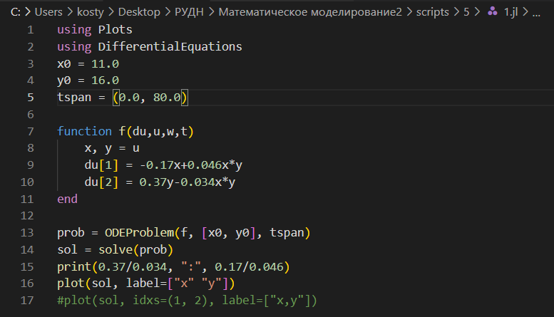
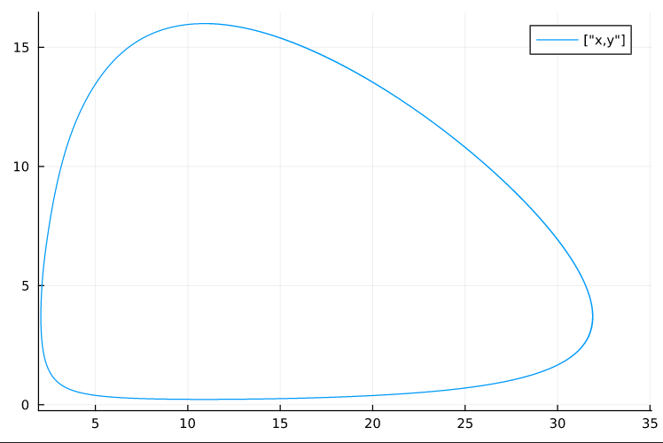
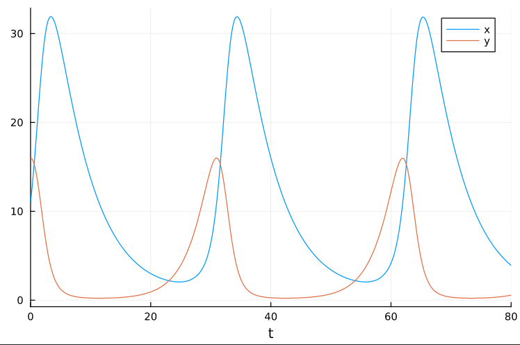
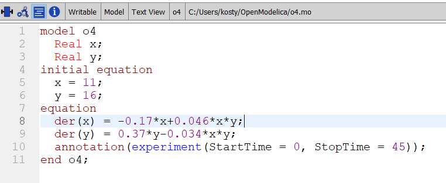
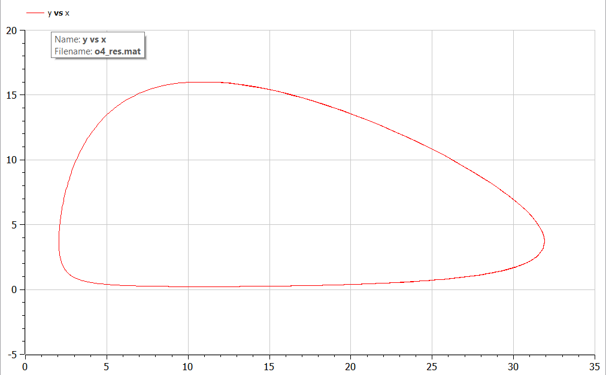
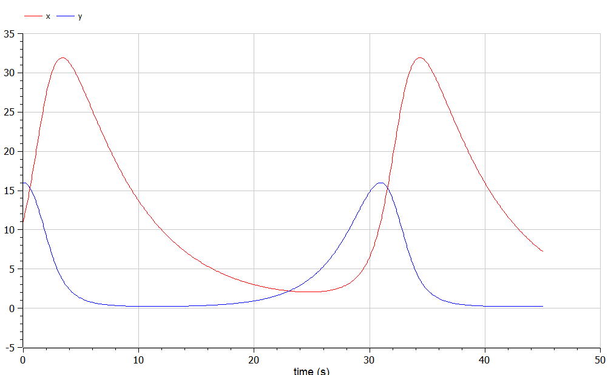

---
## Front matter
lang: ru-RU
title: Лабораторная работа №5
subtitle: Модель хищник-жертва
author:
  - Аникин Константин Сергеевич
institute:
  - Российский университет дружбы народов, Москва, Россия
date: 8 марта 2023

## i18n babel
babel-lang: russian
babel-otherlangs: english

## Formatting pdf
toc: false
toc-title: Содержание
slide_level: 2
aspectratio: 169
section-titles: true
theme: metropolis
header-includes:
 - \metroset{progressbar=frametitle,sectionpage=progressbar,numbering=fraction}
 - '\makeatletter'
 - '\beamer@ignorenonframefalse'
 - '\makeatother'
---

# Информация

## Докладчик

:::::::::::::: {.columns align=center}
::: 

  * Аникин Константин Сергеевич
  * студент
  * просто студент
  * Российский университет дружбы народов
  * [1032201736@rudn.ru](mailto:1032201736@rudn.ru)
  * <https://rituliot.github.io/ru/>

# Вводная часть

## Цель работы

Реализовать жёсткую модель Лотки-Вольтерры в Julia и OpenModelica.

## Задание

- Постройте график зависимости численности хищников от численности жертв, а также графики изменения численности хищников и численности жертв при следующих начальных условиях: x0=11, y0=16. 

- Найдите стационарное состояние системы.

# Julia

## Код программы

Код программы на Julia представлен на рис. \ref{fig1}.

## График зависимости

График зависимости на Julia представлен на рис. \ref{fig2}.

## График зависимости

Графики изменения на Julia представлен на рис. \ref{fig3}.

# OpenModelica

## Код программы

Код программы на OpenModelica представлен на рис. \ref{fig4}.

## График зависимости

График зависимости на OpenModelica представлен на рис. \ref{fig5}.

## График зависимости

Графики изменения на OpenModelica представлен на рис. \ref{fig6}.

# Вывод

В ходе работы была реализована жёсткая модель хищник-жертва и построены необходимые графики. 