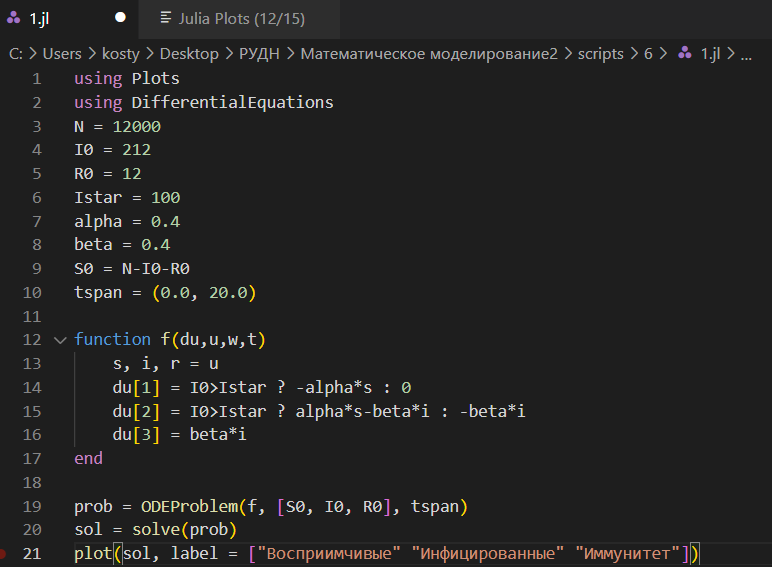
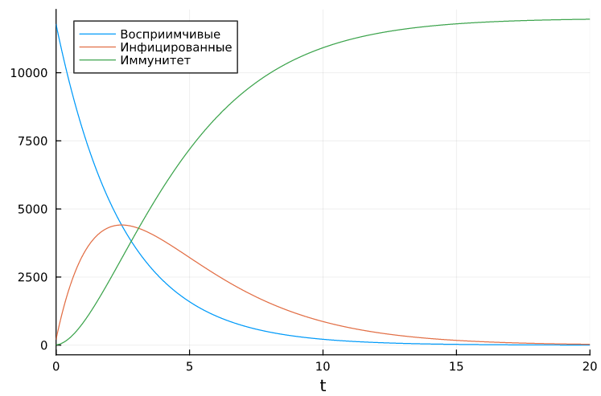
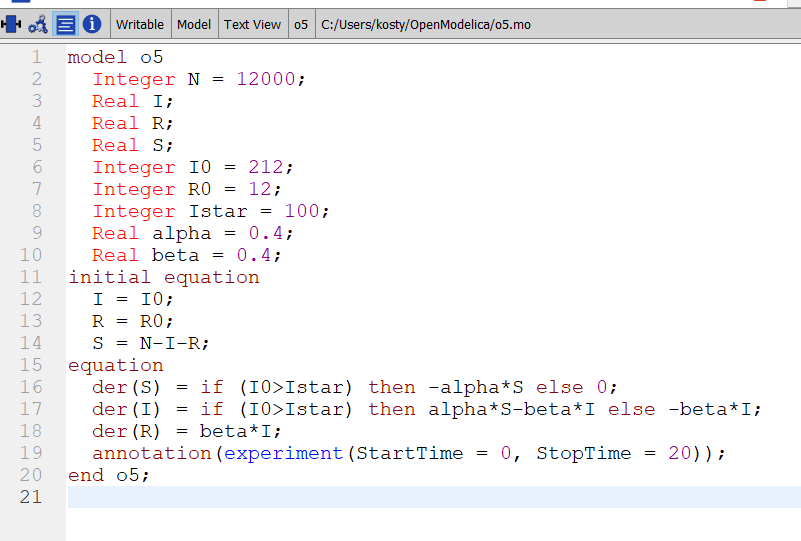

---
## Front matter
title: "Лабораторная работа №6"
subtitle: "Задача об эпидемии"
author: "Аникин Константин Сергеевич"

## Generic otions
lang: ru-RU
toc-title: "Содержание"

## Bibliography
bibliography: bib/cite.bib
csl: pandoc/csl/gost-r-7-0-5-2008-numeric.csl

## Pdf output format
toc: true # Table of contents
toc-depth: 2
lof: true # List of figures
lot: true # List of tables
fontsize: 12pt
linestretch: 1.5
papersize: a4
documentclass: scrreprt
## I18n polyglossia
polyglossia-lang:
  name: russian
  options:
	- spelling=modern
	- babelshorthands=true
polyglossia-otherlangs:
  name: english
## I18n babel
babel-lang: russian
babel-otherlangs: english
## Fonts
mainfont: PT Serif
romanfont: PT Serif
sansfont: PT Sans
monofont: PT Mono
mainfontoptions: Ligatures=TeX
romanfontoptions: Ligatures=TeX
sansfontoptions: Ligatures=TeX,Scale=MatchLowercase
monofontoptions: Scale=MatchLowercase,Scale=0.9
## Biblatex
biblatex: true
biblio-style: "gost-numeric"
biblatexoptions:
  - parentracker=true
  - backend=biber
  - hyperref=auto
  - language=auto
  - autolang=other*
  - citestyle=gost-numeric
## Pandoc-crossref LaTeX customization
figureTitle: "Рис."
tableTitle: "Таблица"
listingTitle: "Листинг"
lofTitle: "Список иллюстраций"
lotTitle: "Список таблиц"
lolTitle: "Листинги"
## Misc options
indent: true
header-includes:
  - \usepackage{indentfirst}
  - \usepackage{float} # keep figures where there are in the text
  - \floatplacement{figure}{H} # keep figures where there are in the text
---

# Цель работы

Решить задачу об эпидемии в Julia и OpenModelica.

# Задание

Вариант 6

- На одном острове вспыхнула эпидемия. Известно, что из всех проживающих на острове (N=12 000) в момент начала эпидемии (t=0) число заболевших людей (являющихся распространителями инфекции) I(0)=212, А число здоровых людей с иммунитетом к болезни R(0)=12. Таким образом, число людей восприимчивых к болезни, но пока здоровых, в начальный момент времени S(0)=N-I(0)-R(0). Постройте графики изменения числа особей в каждой из трех групп. Рассмотрите, как будет протекать эпидемия в обоих случаях.

# Теоретическое введение

Рассмотрим простейшую модель эпидемии. Предположим, что некая популяция, состоящая из N особей, (считаем, что популяция изолирована) подразделяется на три группы. Первая группа - это восприимчивые к болезни, но пока здоровые особи, обозначим их через S(t). Вторая группа – это число инфицированных особей, которые также при этом являются распространителями инфекции, обозначим их I(t). А третья группа, обозначающаяся через R(t) – это здоровые особи с иммунитетом к болезни. 

До того, как число заболевших не превышает критического значения Istar, считаем, что все больные изолированы и не заражают здоровых. Когда I(t)>Istar, тогда инфицирование способны заражать восприимчивых к болезни особей. 

Подробней о задаче эпидемии см. в [@ochkov:1999:mathcad]

# Выполнение лабораторной работы

На рис. @fig:1 представлен код программы на Julia. На рис. @fig:2 представлен график изменения всех трёх групп населения при достижении критической массы заболевших, а на рис. @fig:3 - тот же график, но когда масса не достигнута.

{#fig:1}

{#fig:2}

{#fig:3}

На рис. @fig:4 представлен код программы на OpenModelica. На рис. @fig:5 представлен график изменения всех трёх групп населения при достижении критической массы заболевших, а на рис. @fig:6 - тот же график, но когда масса не достигнута.

{#fig:4}

{#fig:5}

{#fig:6}

# Выводы

В ходе работы была решена задача об эпидемии и построены необходимые графики. 

# Список литературы{.unnumbered}

::: {#refs}
:::
