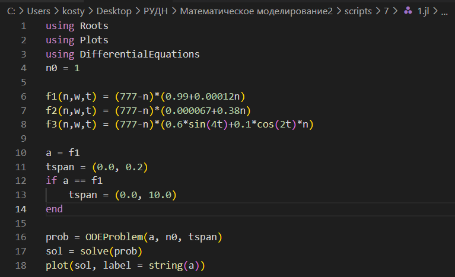
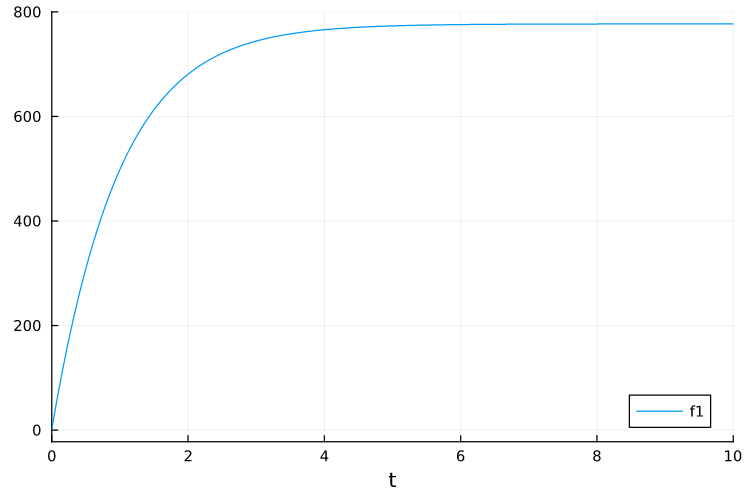
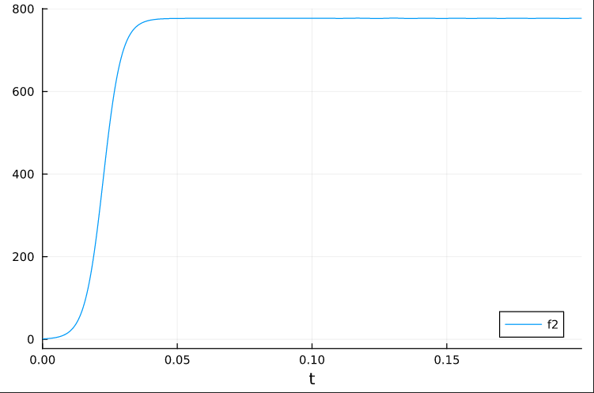
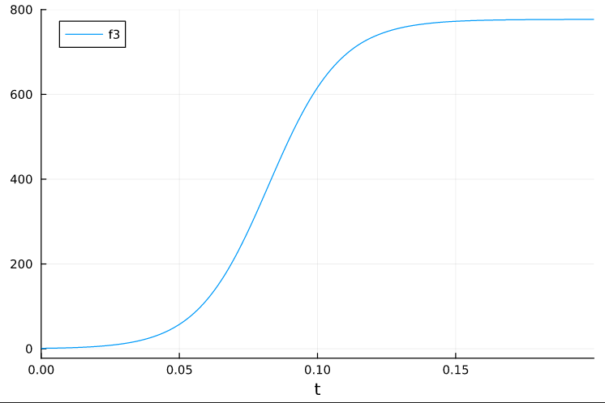
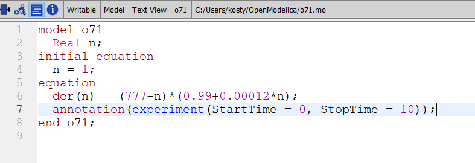
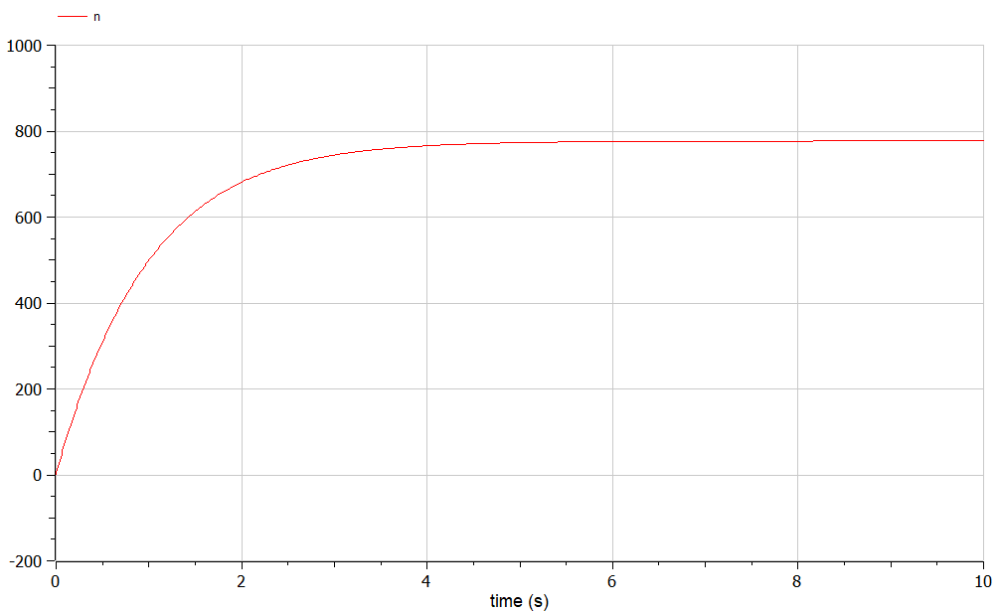
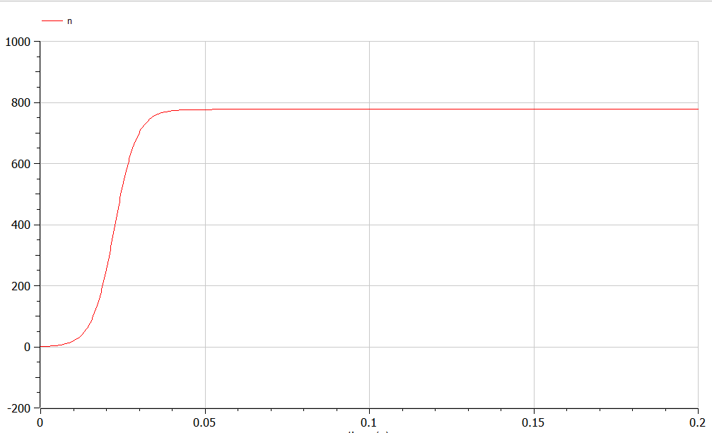
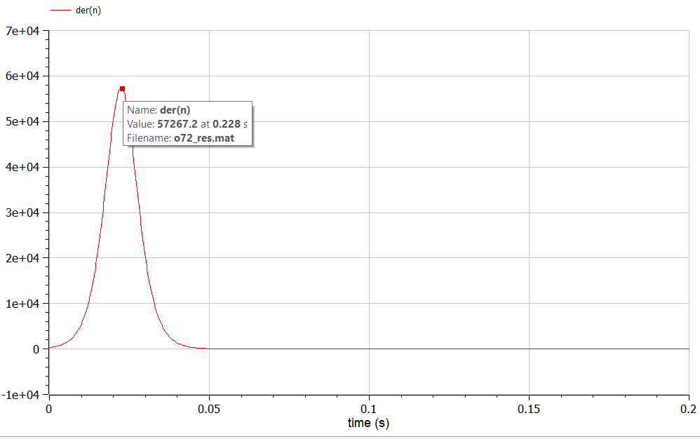
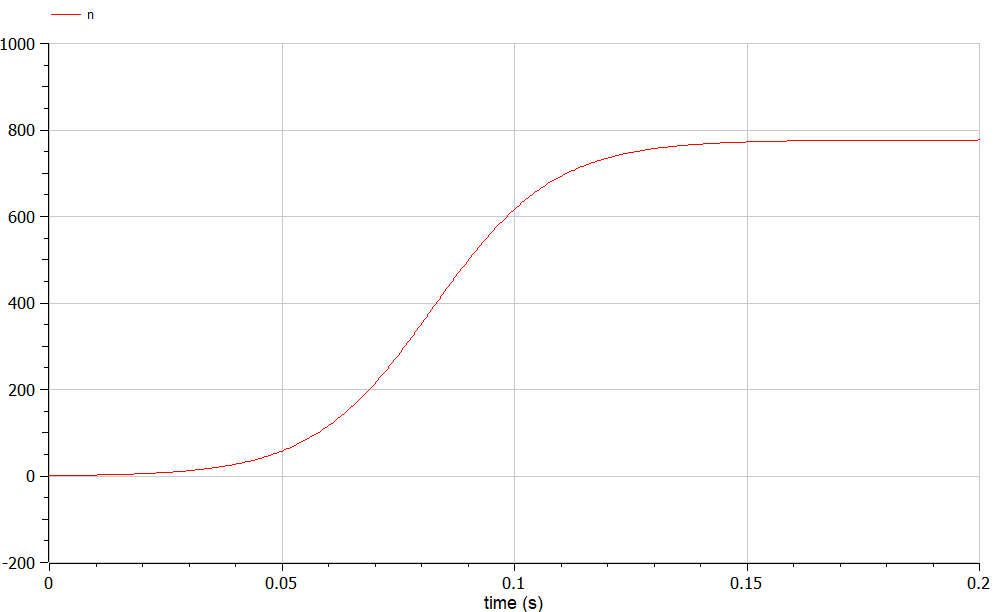

---
## Front matter
lang: ru-RU
title: Лабораторная работа №7
subtitle: Задача об эффективности рекламы
author:
  - Аникин Константин Сергеевич
institute:
  - Российский университет дружбы народов, Москва, Россия
date: 25 марта 2023

## i18n babel
babel-lang: russian
babel-otherlangs: english

## Formatting pdf
toc: false
toc-title: Содержание
slide_level: 2
aspectratio: 169
section-titles: true
theme: metropolis
header-includes:
 - \metroset{progressbar=frametitle,sectionpage=progressbar,numbering=fraction}
 - '\makeatletter'
 - '\beamer@ignorenonframefalse'
 - '\makeatother'
---

# Информация

## Докладчик

:::::::::::::: {.columns align=center}
::: 

  * Аникин Константин Сергеевич
  * студент
  * просто студент
  * Российский университет дружбы народов
  * [1032201736@rudn.ru](mailto:1032201736@rudn.ru)
  * <https://rituliot.github.io/ru/>

# Вводная часть

## Цель работы

Решить задачу об эффективности рекламы в Julia и OpenModelica.

## Задание

- Постройте график распространения рекламы в трёх случаях. 
- Для случая 2 определите в какой момент времени скорость распространения рекламы будет иметь максимальное значение.

# Julia

## Код программы

Код программы на Julia представлен на рис. \ref{fig1}.

## График случая 1

График случая 1 на Julia представлен на рис. \ref{fig2}.

## График случая 2

График случая 2 на Julia представлен на рис. \ref{fig3}.

## График случая 3

График случая 3 на Julia представлен на рис. \ref{fig4}.

# OpenModelica

## Код программы

Код случая 1 на OpenModelica представлен на рис. \ref{fig5}.

## График случая 1

График случая 1 на OpenModelica представлен на рис. \ref{fig6}.

## График случая 2

График случая 2 на OpenModelica представлен на рис. \ref{fig8}.

## Максимальная эффективность

График производной случая 2 на OpenModelica представлен на рис. \ref{fig9}.

## График случая 3

График случая 3 на OpenModelica представлен на рис. \ref{fig10}.

# Вывод

В ходе работы была решена задача об эффективности рекламы и построены необходимые графики. Точно время максимальной эффективности найдено не было.