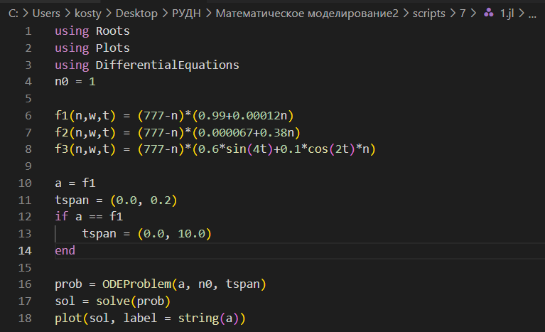
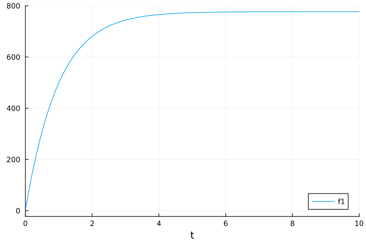
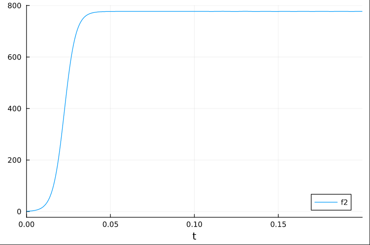
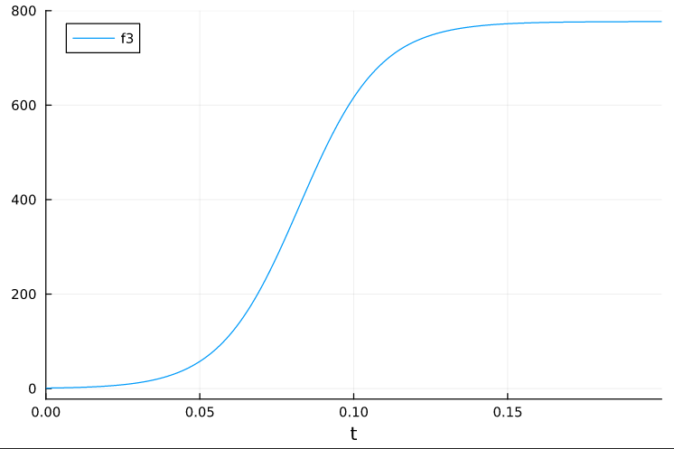
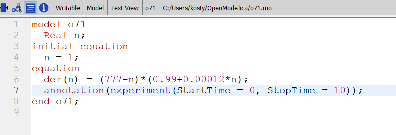
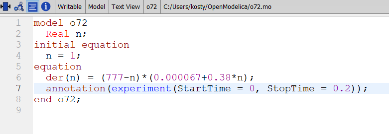
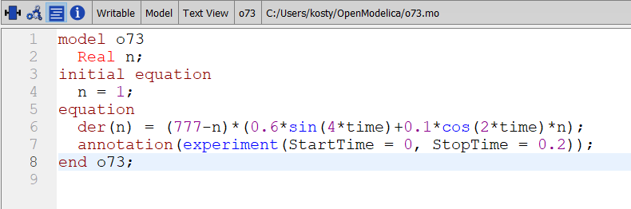
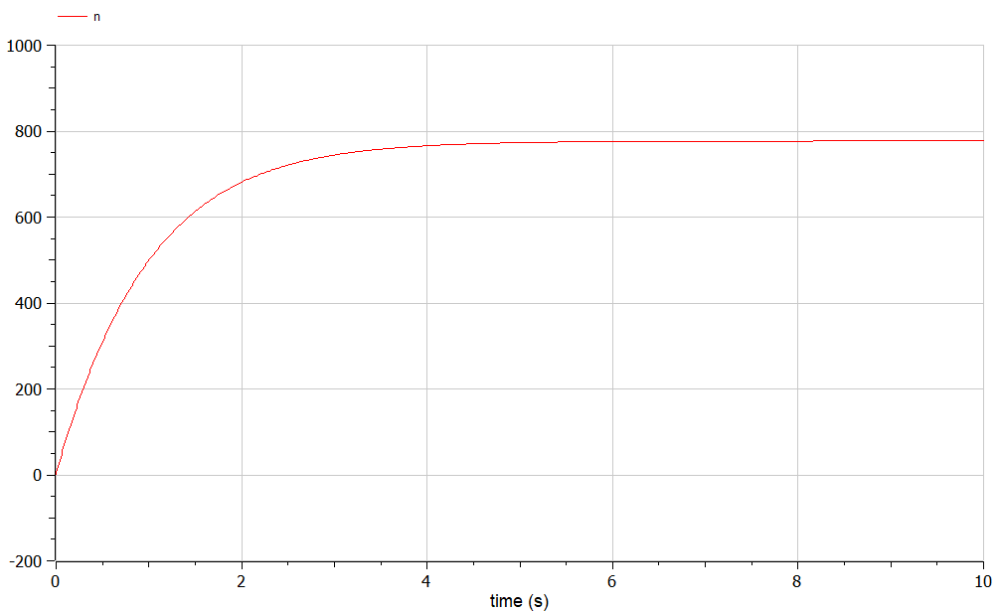
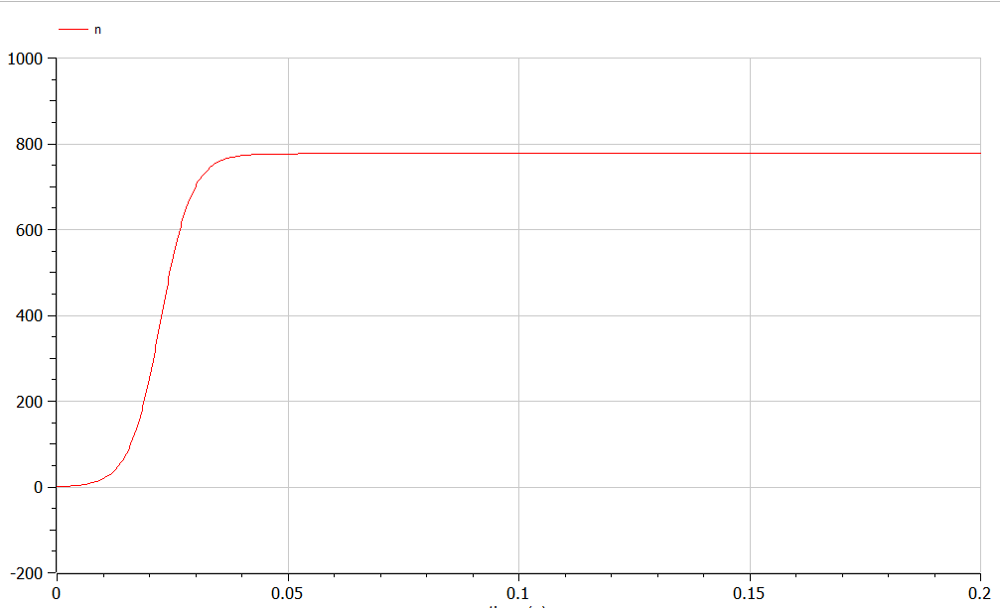
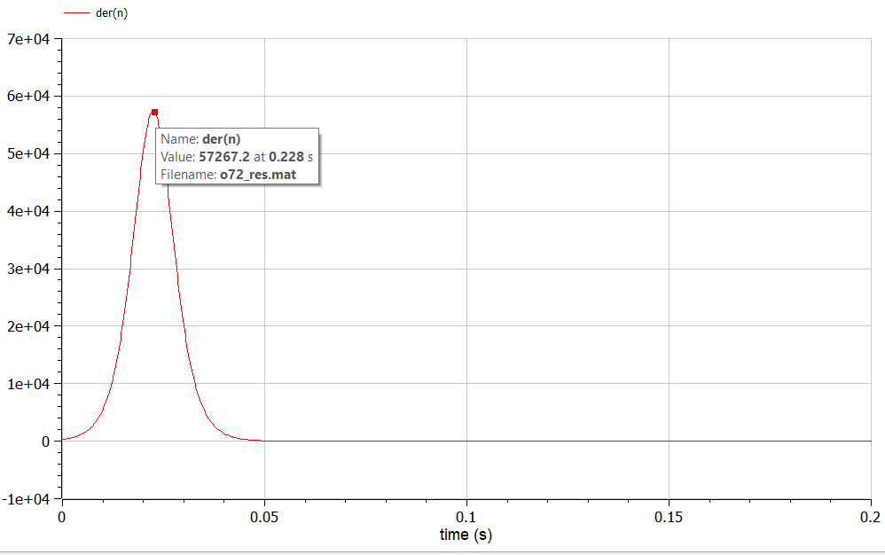

---
## Front matter
title: "Лабораторная работа №7"
subtitle: "Задача об эффективности рекламы "
author: "Аникин Константин Сергеевич"

## Generic otions
lang: ru-RU
toc-title: "Содержание"

## Bibliography
bibliography: bib/cite.bib
csl: pandoc/csl/gost-r-7-0-5-2008-numeric.csl

## Pdf output format
toc: true # Table of contents
toc-depth: 2
lof: true # List of figures
lot: true # List of tables
fontsize: 12pt
linestretch: 1.5
papersize: a4
documentclass: scrreprt
## I18n polyglossia
polyglossia-lang:
  name: russian
  options:
	- spelling=modern
	- babelshorthands=true
polyglossia-otherlangs:
  name: english
## I18n babel
babel-lang: russian
babel-otherlangs: english
## Fonts
mainfont: PT Serif
romanfont: PT Serif
sansfont: PT Sans
monofont: PT Mono
mainfontoptions: Ligatures=TeX
romanfontoptions: Ligatures=TeX
sansfontoptions: Ligatures=TeX,Scale=MatchLowercase
monofontoptions: Scale=MatchLowercase,Scale=0.9
## Biblatex
biblatex: true
biblio-style: "gost-numeric"
biblatexoptions:
  - parentracker=true
  - backend=biber
  - hyperref=auto
  - language=auto
  - autolang=other*
  - citestyle=gost-numeric
## Pandoc-crossref LaTeX customization
figureTitle: "Рис."
tableTitle: "Таблица"
listingTitle: "Листинг"
lofTitle: "Список иллюстраций"
lotTitle: "Список таблиц"
lolTitle: "Листинги"
## Misc options
indent: true
header-includes:
  - \usepackage{indentfirst}
  - \usepackage{float} # keep figures where there are in the text
  - \floatplacement{figure}{H} # keep figures where there are in the text
---

# Цель работы

Решить задачу об эффективности рекламы в Julia и OpenModelica.

# Задание

Вариант 6

- Постройте график распространения рекламы в трёх случаях. 
- Для случая 2 определите в какой момент времени скорость распространения рекламы будет иметь максимальное значение.

# Теоретическое введение

Предположим, что торговыми учреждениями реализуется некоторая продукция, о которой в момент времени t из числа потенциальных покупателей N знает лишь n покупателей. Для ускорения сбыта продукции запускается реклама по радио, телевидению и других средств массовой информации. После запуска рекламной кампании информация о продукции начнет распространяться среди потенциальных покупателей путем общения друг с другом. Таким образом, после запуска рекламных объявлений скорость изменения числа знающих о продукции людей пропорциональна как числу знающих о товаре покупателей, так и числу покупателей о нем не знающих Модель рекламной кампании описывается следующими величинами. Считаем, что dn/dt - скорость изменения со временем числа потребителей, узнавших о товаре и готовых его купить, t - время, прошедшее с начала рекламной кампании, n(t) - число уже информированных клиентов. Эта величина пропорциональна числу покупателей, еще не знающих о нем.

Подробней о задаче эффективности рекламы см. в [@ragimov:2010:marketing]

# Выполнение лабораторной работы

На рис. @fig:1 представлен код программы на Julia, реализованный для всех случаев сразу. На рис. @fig:2, @fig:3 и @fig:4 представлены графики для всех трёх случаев. Максимальное значение скорости для второго случая найдено не было.

{#fig:1}

{#fig:2}

{#fig:3}

{#fig:4}

На рис. @fig:5, @fig:7 и @fig:11 представлены коды программ для трёх случаев на OpenModelica, а на рис. @fig:6, @fig:8 и @fig:10 - графики соответсвующих случаев. На рис. @fig:9 представлен график производной, из которого видно, что максимальная эффективность была достигнута примерно в 0.0228с. Более точного значения получено не было.

{#fig:5}

{#fig:7}

{#fig:11}

{#fig:6}

{#fig:8}

{#fig:10}

{#fig:9}

# Выводы

В ходе работы была решена задача об эффективности рекламы и построены необходимые графики. Точно время максимальной эффективности найдено не было.

# Список литературы{.unnumbered}

::: {#refs}
:::
