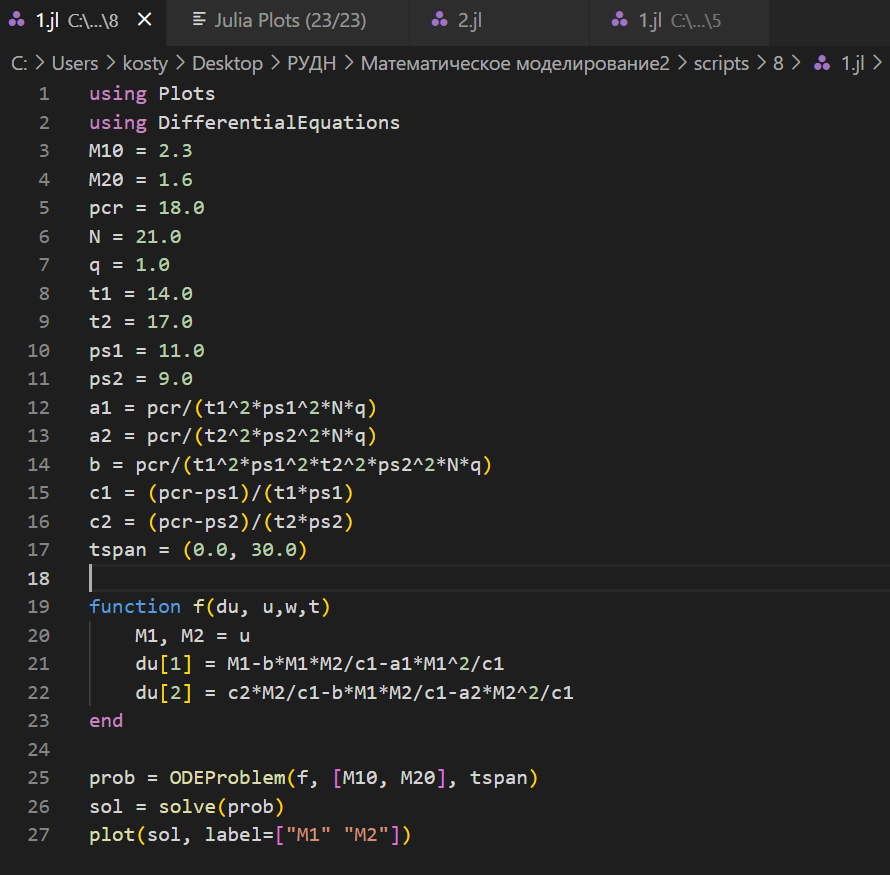

---
## Front matter
lang: ru-RU
title: Лабораторная работа №6
subtitle: Задача об эпидемии
author:
  - Аникин Константин Сергеевич
institute:
  - Российский университет дружбы народов, Москва, Россия
date: 13 марта 2023

## i18n babel
babel-lang: russian
babel-otherlangs: english

## Formatting pdf
toc: false
toc-title: Содержание
slide_level: 2
aspectratio: 169
section-titles: true
theme: metropolis
header-includes:
 - \metroset{progressbar=frametitle,sectionpage=progressbar,numbering=fraction}
 - '\makeatletter'
 - '\beamer@ignorenonframefalse'
 - '\makeatother'
---

# Информация

## Докладчик

:::::::::::::: {.columns align=center}
::: 

  * Аникин Константин Сергеевич
  * студент
  * просто студент
  * Российский университет дружбы народов
  * [1032201736@rudn.ru](mailto:1032201736@rudn.ru)
  * <https://rituliot.github.io/ru/>

# Вводная часть

## Цель работы

Решить задачу об эпидемии в Julia и OpenModelica.

## Задание

На одном острове вспыхнула эпидемия. Известно, что из всех проживающих на острове (N=12 000) в момент начала эпидемии (t=0) число заболевших людей (являющихся распространителями инфекции) I(0)=212, А число здоровых людей с иммунитетом к болезни R(0)=12. Таким образом, число людей восприимчивых к болезни, но пока здоровых, в начальный момент времени S(0)=N-I(0)-R(0). Постройте графики изменения числа особей в каждой из трех групп. Рассмотрите, как будет протекать эпидемия в обоих случаях.

# Julia

## Код программы

Код программы на Julia представлен на рис. \ref{fig1}.

## График с критической массой

График с критической массой на Julia представлен на рис. \ref{fig2}.

## График без критической массы

Графики без критической массы на Julia представлен на рис. \ref{fig3}.

# OpenModelica

## Код программы

Код программы на OpenModelica представлен на рис. \ref{fig4}.

## График с критической массой

График с критической массой на OpenModelica представлен на рис. \ref{fig5}.

## График без критической массы

Графики без критической массы на OpenModelica представлен на рис. \ref{fig6}.

# Вывод

В ходе работы была решена задача об эпидемии и построены необходимые графики. 