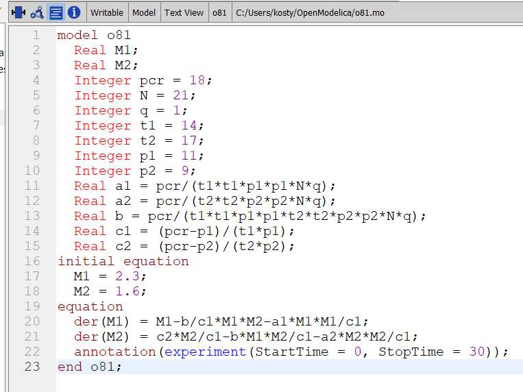

---
## Front matter
lang: ru-RU
title: Лабораторная работа №8
subtitle: Модель конкуренции двух фирм
author:
  - Аникин Константин Сергеевич
institute:
  - Российский университет дружбы народов, Москва, Россия
date: 1 апреля 2023

## i18n babel
babel-lang: russian
babel-otherlangs: english

## Formatting pdf
toc: false
toc-title: Содержание
slide_level: 2
aspectratio: 169
section-titles: true
theme: metropolis
header-includes:
 - \metroset{progressbar=frametitle,sectionpage=progressbar,numbering=fraction}
 - '\makeatletter'
 - '\beamer@ignorenonframefalse'
 - '\makeatother'
---

# Информация

## Докладчик

:::::::::::::: {.columns align=center}
::: 

  * Аникин Константин Сергеевич
  * студент
  * просто студент
  * Российский университет дружбы народов
  * [1032201736@rudn.ru](mailto:1032201736@rudn.ru)
  * <https://rituliot.github.io/ru/>

# Вводная часть

## Цель работы

Построить модель конкуренции двух фирм в Julia и OpenModelica.

## Задание

Рассмотрим две фирмы, производящие взаимозаменяемые товары одинакового качества и находящиеся в одной рыночной нише. Считаем, что в рамках нашей модели конкурентная борьба ведётся только рыночными методами. То есть, конкуренты могут влиять на противника путем изменения параметров своего производства: себестоимость, время цикла, но не могут прямо вмешиваться в ситуацию на рынке («назначать» цену или влиять на потребителей каким-либо иным способом.) Будем считать, что постоянные издержки пренебрежимо малы, и в модели учитывать не будем.

# Julia

## Код первого случая

Код первого случая на Julia представлен на рис. \ref{fig1}.

## Код второго случая

Код второго случая на Julia представлен на рис. \ref{fig2}.

## График первого случая

График первого случая на Julia представлен на рис. \ref{fig3}.

## График второго случая

График второго случая на Julia представлен на рис. \ref{fig4}.

# OpenModelica

## Код первого случая

Код первого случая на OpenModelica представлен на рис. \ref{fig5}.

## Код второго случая

Код второго случая на OpenModelica представлен на рис. \ref{fig6}.

## График первого случая

График первого случая на OpenModelica представлен на рис. \ref{fig7}.

## График второго случая

График второго случая на OpenModelica представлен на рис. \ref{fig8}.

# Вывод

В ходе работы была решена задача об эпидемии и построены необходимые графики. 